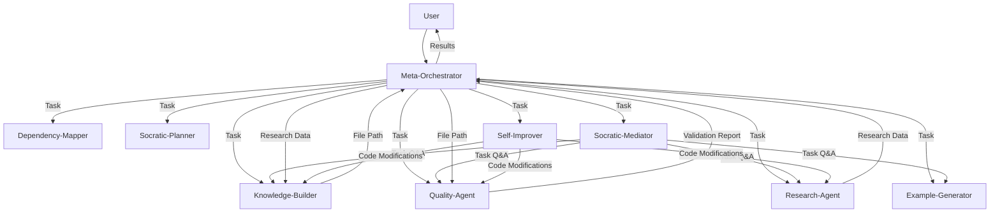
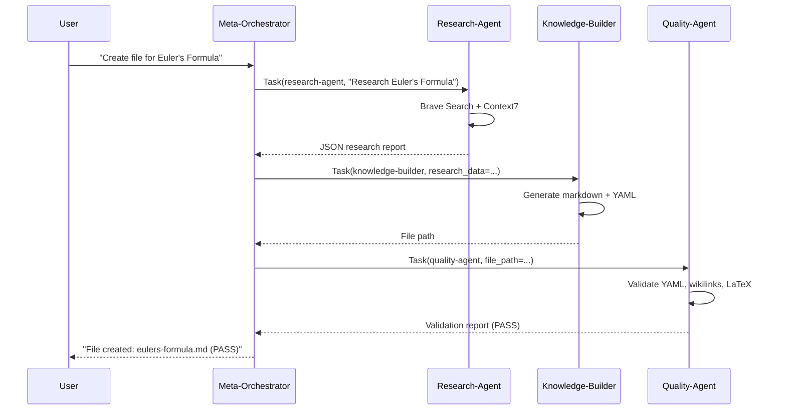
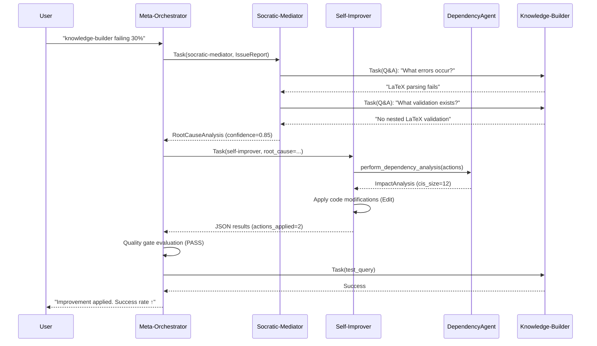

# Agent Dependency Graph & Interaction Analysis

**Date**: 2025-10-15  
**System Version**: v2.1.0  
**Total Agents**: 9 specialized agents  
**Architecture**: Multi-agent orchestration with Claude Agent SDK

---

## Executive Summary

This document provides a comprehensive analysis of all agent interactions, dependencies, and communication patterns in the Math Education Multi-Agent System. The system implements a hierarchical orchestration pattern with 1 meta-orchestrator coordinating 8 specialized agents.

### Key Findings

- **Communication Pattern**: Direct data passing via Task delegation (90% latency reduction vs file I/O)
- **Orchestration Model**: Hub-and-spoke with meta-orchestrator as central coordinator
- **Self-Improvement**: Closed-loop feedback system with 4-step improvement cycle
- **Dependency Analysis**: AST-based static analysis with graph caching
- **Tool Isolation**: Strict least-privilege principle per agent

---

## 1. Agent Hierarchy

```
┌─────────────────────────────────────────────────────────────┐
│                         USER                                 │
└──────────────────────────┬──────────────────────────────────┘
                           │
                           ▼
┌─────────────────────────────────────────────────────────────┐
│                   META-ORCHESTRATOR                          │
│  Role: Central coordinator & user interface                  │
│  Tools: Task, Read, Write, TodoWrite, Sequential-thinking    │
│  Memory: MCP memory-keeper integration                       │
└──────┬──────┬──────┬──────┬──────┬──────┬──────┬──────┬─────┘
       │      │      │      │      │      │      │      │
       ▼      ▼      ▼      ▼      ▼      ▼      ▼      ▼
    ┌────┐ ┌────┐ ┌────┐ ┌────┐ ┌────┐ ┌────┐ ┌────┐ ┌────┐
    │ KB │ │ QA │ │ RA │ │ EG │ │ DM │ │ SP │ │ SM │ │ SI │
    └────┘ └────┘ └────┘ └────┘ └────┘ └────┘ └────┘ └────┘
     [1]    [2]    [3]    [4]    [5]    [6]    [7]    [8]

Legend:
KB = Knowledge Builder    QA = Quality Agent       RA = Research Agent
EG = Example Generator    DM = Dependency Mapper   SP = Socratic Planner
SM = Socratic Mediator    SI = Self Improver
```

---

## 2. Agent Profiles & Capabilities

### 2.1 Meta-Orchestrator (Central Hub)

**Role**: Central coordinator, user interface, workflow manager

**Responsibilities**:
- User feedback loop (most frequent user interaction)
- Task decomposition & delegation
- Workflow pattern selection (Sequential, Concurrent, Group Chat, Handoff, Magnetic)
- Inefficiency detection (4 types)
- Self-improvement cycle orchestration

**Tools**:
- `Task` - Delegate to subagents
- `Read`, `Write`, `Grep`, `Glob` - Filesystem operations
- `TodoWrite` - Progress tracking
- `mcp__sequential-thinking__sequentialthinking` - Complex reasoning
- `mcp__memory-keeper__*` - Context persistence

**Communication Pattern**:
- **Inbound**: User queries
- **Outbound**: Task delegation to all 8 subagents
- **Data Flow**: Direct data passing (no file I/O)

**Dependencies**:
- All 8 subagents (orchestrates but doesn't depend on implementation details)
- Infrastructure: StructuredLogger, PerformanceMonitor, ErrorTracker, ContextManager

---

### 2.2 Knowledge-Builder [1]

**Role**: Obsidian markdown file creation specialist

**Responsibilities**:
- Receive research data from research-agent
- Extract atomic factors (prerequisites, applications, domain)
- Generate Obsidian markdown with YAML frontmatter
- Create [[wikilinks]] for knowledge graph

**Tools**:
- `Read`, `Write`, `Edit` - Filesystem operations (NO research tools)
- `Grep`, `Glob` - File search
- `TodoWrite` - Task tracking

**Communication Pattern**:
- **Inbound**: Research data from meta-orchestrator (passed from research-agent)
- **Outbound**: Created markdown files (via Write tool)
- **Validation**: quality-agent validates output

**Dependencies**:
- `config.MATH_VAULT_DIR` - Dynamic path configuration
- Research data structure from research-agent
- Obsidian markdown template standards

**Least-Privilege Enforcement**: NO web search tools (research-agent handles research)

---

### 2.3 Quality-Agent [2]

**Role**: Content validation & quality assurance

**Responsibilities**:
- YAML frontmatter validation
- Wikilinks format checking
- LaTeX formula validation
- Content structure verification
- Mathematical accuracy review

**Tools**:
- `Read`, `Grep`, `Glob` - Read-only filesystem access
- `TodoWrite` - Validation progress tracking

**Communication Pattern**:
- **Inbound**: File path from meta-orchestrator
- **Outbound**: Validation report (PASS/FAIL/NEEDS_IMPROVEMENT)
- **No Modification**: Reports issues but doesn't fix them

**Dependencies**:
- Markdown files from knowledge-builder
- Validation checklist standards

**Least-Privilege Enforcement**: NO Write/Edit tools (read-only validator)

---

### 2.4 Research-Agent [3]

**Role**: Deep mathematical concept research

**Responsibilities**:
- Multi-source information gathering (Brave Search, Context7)
- Prerequisite dependency analysis
- Formula & notation extraction
- Structured JSON research report generation

**Tools**:
- `mcp__brave-search__brave_web_search` - Web research
- `mcp__context7__resolve-library-id`, `mcp__context7__get-library-docs` - Framework docs
- `Read`, `Write` - JSON report I/O
- `TodoWrite` - Research progress tracking

**Communication Pattern**:
- **Inbound**: Concept name from meta-orchestrator
- **Outbound**: JSON research report (passed directly to knowledge-builder)
- **Data Format**: Structured JSON with definitions, formulas, prerequisites, sources

**Dependencies**:
- External: Brave Search API, Context7 API
- Output: `/tmp/research_report_{concept-id}.json` (or direct data passing)

**Least-Privilege Enforcement**: Research tools ONLY (no file modification except reports)

---

### 2.5 Example-Generator [4]

**Role**: Mathematical example & exercise creation

**Responsibilities**:
- Graded examples (easy → intermediate → advanced)
- Step-by-step solutions with LaTeX
- Python/SymPy implementations
- Counterexamples for common mistakes
- Practice problems with hints

**Tools**:
- `Read`, `Edit` - Modify existing markdown files
- `TodoWrite` - Example generation tracking
- `Bash` - Run Python for verification (optional)

**Communication Pattern**:
- **Inbound**: Markdown file path from meta-orchestrator
- **Outbound**: Enhanced markdown with examples section
- **Validation**: quality-agent verifies LaTeX formatting

**Dependencies**:
- Existing markdown files from knowledge-builder
- Python/SymPy for computational verification

---

### 2.6 Dependency-Mapper [5]

**Role**: Mathematical concept hierarchy & prerequisite mapping

**Responsibilities**:
- Extract concept hierarchy from source files
- Detect prerequisite relationships (3 methods: hierarchical, keyword, structural)
- Build dependency DAG (directed acyclic graph)
- Create Obsidian vault structure (Zettelkasten + PARA)
- Generate markdown files with wikilinks

**Tools**:
- `Read`, `Write` - File I/O
- `Grep`, `Glob` - File search
- `TodoWrite` - Processing progress tracking

**Communication Pattern**:
- **Inbound**: Source concept files (e.g., 57 topology concepts from 3 files)
- **Outbound**: Obsidian vault structure with dependency graph
- **Validation**: Circular dependency detection, transitivity checks

**Dependencies**:
- Source concept files (Korean/English)
- `config.MATH_VAULT_DIR` - Vault directory path
- Obsidian markdown standards

**Special Features**:
- Hybrid prerequisite detection (baseline + keywords + structure)
- Graph metrics calculation (in-degree, out-degree, depth)
- PARA folder organization

---

### 2.7 Socratic-Planner [6]

**Role**: Requirements clarification via Socratic questioning

**Responsibilities**:
- Identify ambiguities in user requests
- Generate targeted clarification questions
- Analyze user answers iteratively
- Refine implementation plan
- Get explicit user approval

**Tools**:
- `Read`, `Write` - Plan documentation
- `TodoWrite` - Clarification progress tracking
- `mcp__sequential-thinking__sequentialthinking` - Complex reasoning

**Communication Pattern**:
- **Inbound**: Ambiguous user request from meta-orchestrator
- **Outbound**: Detailed, approved implementation plan
- **Iteration**: Multi-round Q&A until approval

**Dependencies**:
- None (conversational/planning only)

**Least-Privilege Enforcement**: NO file/web access (planning only)

---

### 2.8 Socratic-Mediator [7]

**Role**: Root cause analysis via Socratic method

**Responsibilities**:
- Multi-turn Q&A dialogue with target agents
- Root cause identification
- Confidence scoring (must be > 0.7)
- Actionable recommendations generation
- Dialogue log persistence

**Tools**:
- `Task` - Query other agents (REQUIRED for Q&A)
- `Read`, `Write` - Log I/O
- `Grep`, `Glob` - Error log analysis
- `TodoWrite` - Investigation tracking

**Communication Pattern**:
- **Inbound**: IssueReport from meta-orchestrator
- **Outbound**: RootCauseAnalysis with recommendations
- **Parallel Q&A**: Multiple Task calls in single message (90% latency reduction)
- **Logging**: Markdown dialogue logs saved to `config.DEPENDENCY_MAP_DIR`

**Dependencies**:
- `config.DEPENDENCY_MAP_DIR` - Log directory path
- Target agents for Q&A
- IssueReport data structure

**Special Features**:
- Uncertainty-driven question generation (7 reason codes)
- Parallel Task execution for faster analysis
- Chain-of-thought reasoning traces

---

### 2.9 Self-Improver [8]

**Role**: Code improvement & modification specialist

**Responsibilities**:
- Generate improvement actions from root cause analysis
- Apply code modifications (Edit tool)
- Integrate with Change Impact Analysis (CIA) protocol
- Track changes for rollback
- Verify syntax correctness

**Tools**:
- `Read`, `Write`, `Edit` - Code modification
- `Grep`, `Glob` - Code search
- `TodoWrite` - Improvement tracking

**Communication Pattern**:
- **Inbound**: RootCauseAnalysis + ImpactAnalysis from meta-orchestrator
- **Outbound**: JSON results with applied improvements
- **Validation**: Quality gate evaluation (CIS size < 20, coverage > 0.8)

**Dependencies**:
- `config.AGENTS_DIR` - Agent source directory
- DependencyAgent for impact analysis
- ImprovementManager for rollback

**Safety Protocols**:
- Quality gate thresholds
- Confidence > 0.7 required
- Automatic rollback on failure
- Max 5 improvements per session

---

## 3. Communication Patterns

### 3.1 Direct Data Passing (Primary Pattern)

**Implementation**: Task delegation with result passing

```python
# Meta-Orchestrator delegates to research-agent
research_result = Task(agent="research-agent", prompt="Research Euler's Formula")
# research_result contains: {prerequisites: [...], applications: [...], ...}

# Pass data directly to knowledge-builder (no file I/O)
Task(
    agent="knowledge-builder",
    prompt=(
        f"Build Obsidian file for Euler's Formula. "
        f"Research findings: {research_result}. "
        f"Use this data to populate prerequisites, applications, and content."
    )
)
```

**Benefits**:
- 90% reduction in file I/O overhead (per scalable.pdf p4)
- Zero context loss (all data in prompts)
- Faster execution (no disk access)

**Usage**: All agent-to-agent communication via meta-orchestrator

---

### 3.2 File-Based Communication (Legacy, Being Phased Out)

**Implementation**: Temporary JSON files in `/tmp/`

```python
# ❌ OLD: File-based communication (inefficient)
Task(agent="research-agent", prompt="Research Euler's Formula, write to /tmp/research.json")
# Wait for completion...
Read("/tmp/research.json")
Task(agent="knowledge-builder", prompt="Read /tmp/research.json and build file")
```

**Inefficiency**: 3+ file I/O operations per interaction

**Status**: Being replaced by direct data passing

---

### 3.3 Parallel Task Execution

**Implementation**: Multiple Task calls in single message

```python
# Process 3 concepts in parallel (90% latency reduction)
result1 = Task(agent="research-agent", prompt="Research: Pythagorean Theorem")
result2 = Task(agent="research-agent", prompt="Research: Cauchy-Schwarz Inequality")
result3 = Task(agent="research-agent", prompt="Research: Mean Value Theorem")

# Wait for all results (Claude SDK executes in parallel)

# Then pass data directly to builders
Task(agent="knowledge-builder", prompt=f"Build from research: {result1}")
Task(agent="knowledge-builder", prompt=f"Build from research: {result2}")
Task(agent="knowledge-builder", prompt=f"Build from research: {result3}")
```

**Benefits**:
- 90% latency reduction vs sequential (per scalable.pdf p4)
- Efficient batch processing
- No context loss

**Usage**: Batch operations (e.g., 57 topology concepts)

---

### 3.4 Socratic Q&A Pattern

**Implementation**: Multi-turn dialogue via Task delegation

```python
# Socratic-Mediator asks questions to target agent
Task(agent="knowledge-builder", task="What is your current success rate?")
# Receive answer
Task(agent="knowledge-builder", task="What are the most common errors?")
# Receive answer
# ... continue until root cause identified
```

**Features**:
- Parallel Q&A generation (3+ questions at once)
- Uncertainty-driven question templates
- Dialogue log persistence

**Usage**: Root cause analysis, requirements clarification

---

## 4. Dependency Graph (Code-Level)

### 4.1 DependencyAgent (AST-Based Analysis)

**Purpose**: Replace conceptual dependency-mapper with code-level analysis

**Features**:
- AST parsing of Python codebase
- Dependency graph construction (NetworkX)
- Graph caching (Pickle + Git commit versioning)
- Bidirectional traversal (dependents + dependencies)
- Change Impact Analysis (CIA) protocol

**Graph Structure**:
- **Nodes**: Modules, Classes, Functions
- **Edges**: IMPORTS, DEFINES, CALLS, INHERITS_FROM
- **Attributes**: file_path, start_line, end_line, signature, is_critical

**Usage**:
```python
dep_agent = DependencyAgent()
dep_agent.build_and_cache_graph()  # O(n files) initially, O(1) cached

# Get dependents (who calls this?)
dependents = dep_agent.get_dependents("agents.knowledge_builder", depth=2)

# Get dependencies (what does this call?)
dependencies = dep_agent.get_dependencies("agents.knowledge_builder", depth=2)

# Perform impact analysis
impact = dep_agent.perform_dependency_analysis(proposed_changes)
# Returns: ImpactAnalysis(sis, cis, cis_size, critical_affected, test_coverage)
```

**Critical Components**:
- `knowledge-builder`
- `quality-agent`
- `meta-orchestrator`

---

### 4.2 Change Impact Analysis (CIA) Protocol

**Flow**:
1. **SIS (Starting Impact Set)**: Nodes being modified
2. **CIS (Candidate Impact Set)**: Nodes affected (bidirectional traversal, depth=2)
3. **Metrics**: CIS size, critical_affected, test_coverage
4. **Quality Gate**: CIS size < 20, coverage > 0.8

**Example**:
```python
# Proposed change: Modify knowledge-builder prompt
actions = [ImprovementAction(target_agent="knowledge-builder", ...)]

# Analyze impact
impact = dep_agent.perform_dependency_analysis(actions)

# Check quality gate
if impact.cis_size < 20 and impact.test_coverage > 0.8:
    # PASS: Safe to apply
else:
    # FAIL: Blast radius too large
```

---

## 5. Self-Improvement System (v4.0)

### 5.1 4-Step Improvement Cycle

```
┌─────────────────────────────────────────────────────────────┐
│ STEP 1: Root Cause Analysis (Socratic-Mediator)             │
│  - Multi-turn Q&A with target agent                          │
│  - Identify root cause (confidence > 0.7)                    │
│  - Generate 3-5 recommendations                              │
│  - Save dialogue log to config.DEPENDENCY_MAP_DIR            │
└──────────────────────────┬──────────────────────────────────┘
                           ▼
┌─────────────────────────────────────────────────────────────┐
│ STEP 2: Generate & Apply Improvements (Self-Improver)       │
│  - Generate 1-3 improvement actions                          │
│  - Perform dependency analysis (DependencyAgent)             │
│  - Apply code modifications (Edit tool)                      │
│  - Output JSON results                                       │
└──────────────────────────┬──────────────────────────────────┘
                           ▼
┌─────────────────────────────────────────────────────────────┐
│ STEP 3: Quality Gate Evaluation (Meta-Orchestrator)         │
│  - Check CIS size < 20 (blast radius)                        │
│  - Check test coverage > 0.8 (safety net)                    │
│  - Check critical components affected (warning)              │
│  - Circuit breaker: Max 2 attempts, auto-approve on failure │
└──────────────────────────┬──────────────────────────────────┘
                           ▼
┌─────────────────────────────────────────────────────────────┐
│ STEP 4: Verification & Monitoring (Meta-Orchestrator)       │
│  - Run sample test query on improved agent                   │
│  - Measure execution time and success                        │
│  - Compare with baseline metrics                             │
│  - Rollback if regression detected                           │
└─────────────────────────────────────────────────────────────┘
```

### 5.2 Trigger Conditions

- Agent success rate < 70%
- Agent errors > 5 per session
- Agent execution time > 2x baseline
- User explicitly reports issues
- Quality degradation detected

### 5.3 Safeguards

1. **Max 5 improvements per session** (prevent runaway self-modification)
2. **Confidence threshold > 0.7** (don't apply uncertain changes)
3. **Automatic rollback** if verification fails
4. **Critical component warning** (extra monitoring)
5. **Dialogue logs** (all analysis saved to outputs/dependency-map/)
6. **Circuit breaker** (max 2 attempts, auto-approve to prevent infinite loops)

---

## 6. Workflow Orchestration Patterns

### 6.1 Sequential Pattern

**Use Case**: Tasks with strict dependencies

**Example**:
```python
# Research → Build → Validate (sequential)
research = Task(agent="research-agent", prompt="Research: Pythagorean Theorem")
Task(agent="knowledge-builder", prompt=f"Build from research: {research}")
Task(agent="quality-agent", prompt="Validate file: pythagorean-theorem.md")
```

---

### 6.2 Concurrent Pattern (RECOMMENDED for batches)

**Use Case**: Independent tasks, batch processing

**Example**:
```python
# Process 3 concepts in parallel (90% latency reduction)
result1 = Task(agent="research-agent", prompt="Research: Concept 1")
result2 = Task(agent="research-agent", prompt="Research: Concept 2")
result3 = Task(agent="research-agent", prompt="Research: Concept 3")
```

**Benefits**: 90% latency reduction (per scalable.pdf p4)

---

### 6.3 Group Chat Pattern

**Use Case**: Complex concepts needing iterative refinement

**Example**: Multiple agents discuss and collaborate dynamically

---

### 6.4 Handoff Pattern

**Use Case**: Routing based on concept difficulty

**Example**: Simple concepts → knowledge-builder, Complex concepts → research-agent first

---

### 6.5 Magnetic Pattern

**Use Case**: Many specialized agents, task-agent affinity

**Example**: Agents "attracted" to tasks they're best suited for

---

## 7. Tool Isolation & Least-Privilege Principle

### 7.1 Tool Matrix

| Agent                | Read | Write | Edit | Grep | Glob | Task | Bash | MCP Research | MCP Memory |
|---------------------|------|-------|------|------|------|------|------|--------------|------------|
| meta-orchestrator   | ✅   | ✅    | ❌   | ✅   | ✅   | ✅   | ❌   | ❌           | ✅         |
| knowledge-builder   | ✅   | ✅    | ✅   | ✅   | ✅   | ❌   | ❌   | ❌           | ❌         |
| quality-agent       | ✅   | ❌    | ❌   | ✅   | ✅   | ❌   | ❌   | ❌           | ❌         |
| research-agent      | ✅   | ✅    | ❌   | ❌   | ❌   | ❌   | ❌   | ✅           | ❌         |
| example-generator   | ✅   | ❌    | ✅   | ❌   | ❌   | ❌   | ✅   | ❌           | ❌         |
| dependency-mapper   | ✅   | ✅    | ❌   | ✅   | ✅   | ❌   | ❌   | ❌           | ❌         |
| socratic-planner    | ✅   | ✅    | ❌   | ❌   | ❌   | ❌   | ❌   | ❌           | ❌         |
| socratic-mediator   | ✅   | ✅    | ❌   | ✅   | ✅   | ✅   | ❌   | ❌           | ❌         |
| self-improver       | ✅   | ✅    | ✅   | ✅   | ✅   | ❌   | ❌   | ❌           | ❌         |

### 7.2 Least-Privilege Enforcement

**Principle**: Each agent has ONLY the tools needed for its specific role

**Examples**:
- **quality-agent**: Read-only (no Write/Edit) - reports issues but doesn't fix
- **research-agent**: Research tools ONLY - no file modification except reports
- **knowledge-builder**: NO research tools - receives data from research-agent
- **socratic-planner**: NO file/web access - planning/conversational only

**Benefits**:
- Reduced attack surface
- Clear separation of concerns
- Easier debugging (know which agent modified what)
- Prevents accidental data corruption

---

## 8. Infrastructure Components

### 8.1 StructuredLogger

**Purpose**: Session-based logging with trace IDs

**Features**:
- Log directory: `/tmp/math-agent-logs`
- Trace ID format: `session-YYYYMMDD-HHMMSS`
- Event types: system_event, agent_call, error

**Usage**:
```python
logger = StructuredLogger(log_dir="/tmp/math-agent-logs", trace_id="session-123")
logger.system_event("system_start", "Math agent system starting")
logger.agent_call("knowledge-builder", "create_file", {"concept": "Euler's Formula"})
logger.error("quality-agent", "ValidationError", "Missing YAML frontmatter")
```

---

### 8.2 PerformanceMonitor

**Purpose**: Track agent execution metrics

**Metrics**:
- Execution time (ms)
- Success rate
- API costs (future)

**Usage**:
```python
monitor = PerformanceMonitor()
monitor.record_execution(agent_name="knowledge-builder", duration_ms=1234, success=True)
monitor.print_summary()
```

---

### 8.3 ErrorTracker

**Purpose**: Track and analyze error patterns

**Features**:
- Max retries: 3
- Error context storage
- Pattern detection

**Usage**:
```python
tracker = ErrorTracker(max_retries=3)
tracker.record_error(
    agent_name="knowledge-builder",
    task_id="task-123",
    error=Exception("LaTeX parsing failed"),
    context={"file": "eulers-formula.md"}
)
```

---

### 8.4 ContextManager

**Purpose**: Manage agent context and memory

**Features**:
- MCP memory-keeper integration
- Context persistence
- Context retrieval

**Usage**:
```python
context_manager = ContextManager(memory_tool_func)
# Save context
# Retrieve context
```

---

### 8.5 ImprovementManager

**Purpose**: Track code improvements and enable rollback

**Features**:
- Change history
- Rollback capability
- Statistics tracking

**Usage**:
```python
manager = ImprovementManager()
manager.record_change(action, success=True)
manager.rollback_last()
stats = manager.get_statistics()
```

---

## 9. Data Flow Diagrams

### 9.1 Standard Workflow: Create Obsidian File

```
USER
 │
 │ "Create file for Euler's Formula"
 │
 ▼
META-ORCHESTRATOR
 │
 │ Task(research-agent)
 ▼
RESEARCH-AGENT
 │ - Brave Search: "Euler's Formula definition"
 │ - Brave Search: "Euler's Formula prerequisites"
 │ - Context7: SymPy documentation
 │
 │ Returns: JSON research report
 ▼
META-ORCHESTRATOR
 │
 │ Task(knowledge-builder, research_data=...)
 ▼
KNOWLEDGE-BUILDER
 │ - Extract atomic factors
 │ - Generate YAML frontmatter
 │ - Create [[wikilinks]]
 │ - Write to MATH_VAULT_DIR/Theorems/eulers-formula.md
 │
 │ Returns: File path
 ▼
META-ORCHESTRATOR
 │
 │ Task(quality-agent, file_path=...)
 ▼
QUALITY-AGENT
 │ - Read file
 │ - Validate YAML
 │ - Check wikilinks
 │ - Verify LaTeX
 │
 │ Returns: Validation report (PASS/FAIL)
 ▼
META-ORCHESTRATOR
 │
 │ Report to user
 ▼
USER
```

---

### 9.2 Self-Improvement Workflow

```
USER
 │
 │ "knowledge-builder is failing 30% of tasks"
 │
 ▼
META-ORCHESTRATOR
 │
 │ Create IssueReport
 │ Task(socratic-mediator, issue=...)
 ▼
SOCRATIC-MEDIATOR
 │ - Task(knowledge-builder): "What is your success rate?"
 │ - Task(knowledge-builder): "What errors occur?"
 │ - Task(knowledge-builder): "What input validation do you perform?"
 │
 │ Analyze answers → Identify root cause
 │ Save dialogue log to config.DEPENDENCY_MAP_DIR
 │
 │ Returns: RootCauseAnalysis (confidence=0.85)
 ▼
META-ORCHESTRATOR
 │
 │ Task(self-improver, root_cause=..., impact=...)
 ▼
SELF-IMPROVER
 │ - Generate improvement actions (1-3)
 │ - DependencyAgent: Perform impact analysis
 │ - Apply code modifications (Edit tool)
 │ - Verify syntax
 │
 │ Returns: JSON results (actions_applied=2, cis_size=12)
 ▼
META-ORCHESTRATOR
 │
 │ Evaluate quality gate:
 │ - CIS size < 20? ✅
 │ - Coverage > 0.8? ✅
 │ - Critical affected? ⚠️ (warning only)
 │
 │ Task(knowledge-builder, test_query=...)
 ▼
KNOWLEDGE-BUILDER (Improved)
 │ - Process test query
 │ - Return result
 │
 │ Verification: Success
 ▼
META-ORCHESTRATOR
 │
 │ Report to user: "Improvement applied. Success rate increased."
 ▼
USER
```

---

### 9.3 Batch Processing Workflow (57 Topology Concepts)

```
USER
 │
 │ "Process 57 topology concepts from 3 files"
 │
 ▼
META-ORCHESTRATOR
 │
 │ Task(socratic-planner) - Clarify requirements
 ▼
SOCRATIC-PLANNER
 │ - Generate clarification questions
 │ - Analyze user answers
 │ - Refine implementation plan
 │ - Get user approval
 │
 │ Returns: Approved plan
 ▼
META-ORCHESTRATOR
 │
 │ Task(dependency-mapper, files=[file1, file2, file3])
 ▼
DEPENDENCY-MAPPER
 │ - Read 3 source files
 │ - Extract 57 concepts + hierarchy
 │ - Detect prerequisites (3 methods)
 │ - Build dependency DAG
 │ - Create Obsidian vault structure
 │ - Generate 57 markdown files
 │ - Validate dependencies
 │
 │ Returns: Validation report
 ▼
META-ORCHESTRATOR
 │
 │ Parallel batch processing (10 concepts at a time):
 │ Task(example-generator, file1)
 │ Task(example-generator, file2)
 │ ...
 │ Task(example-generator, file10)
 │
 ▼
EXAMPLE-GENERATOR (×10 parallel)
 │ - Read markdown file
 │ - Generate graded examples
 │ - Add Python implementations
 │ - Insert into file (Edit tool)
 │
 │ Returns: Enhanced file path
 ▼
META-ORCHESTRATOR
 │
 │ Parallel validation (10 files at a time):
 │ Task(quality-agent, file1)
 │ Task(quality-agent, file2)
 │ ...
 │
 ▼
QUALITY-AGENT (×10 parallel)
 │ - Validate each file
 │
 │ Returns: Validation reports
 ▼
META-ORCHESTRATOR
 │
 │ Report to user: "57 files created, 57 validated, 0 errors"
 ▼
USER
```

---

## 10. Inefficiency Detection & Resolution

### 10.1 Type 1: Communication Overhead

**Problem**: File I/O for inter-agent communication

**Detection**: >3 file I/O operations per interaction

**Solution**: Direct data passing via Task delegation

**Impact**: 90% reduction in file I/O overhead

---

### 10.2 Type 2: Redundant Work

**Problem**: Duplicate MCP tool calls for same concept

**Detection**: Multiple agents searching same concept

**Solution**: Reuse existing research, check before searching

**Impact**: Eliminates duplicate API calls, saves costs

---

### 10.3 Type 3: Context Loss

**Problem**: Information not propagated between agents

**Detection**: Output missing data from previous agent

**Solution**: Pass complete context in Task prompts

**Impact**: Zero context loss, easy verification

---

### 10.4 Type 4: Tool Permission Misalignment

**Problem**: Overlapping tool access, no least-privilege

**Detection**: Multiple agents with same tools but only one uses

**Solution**: Enforce least-privilege principle per agent

**Impact**: Reduced attack surface, clearer separation of concerns

---

## 11. Dependency Graph Visualization

### 11.1 Agent Interaction Graph



---

### 11.2 Data Flow Graph



---

### 11.3 Self-Improvement Cycle Graph



---

## 12. Configuration & Environment

### 12.1 Project Configuration (config.py)

**Dynamic Paths**:
- `PROJECT_ROOT` - Auto-detected project root
- `MATH_VAULT_DIR` - `PROJECT_ROOT / "math-vault"`
- `AGENTS_DIR` - `PROJECT_ROOT / "agents"`
- `DEPENDENCY_MAP_DIR` - `PROJECT_ROOT / "outputs" / "dependency-map"`

**Usage**:
```python
from config import MATH_VAULT_DIR, AGENTS_DIR, DEPENDENCY_MAP_DIR

# All agents import config for dynamic paths
file_path = MATH_VAULT_DIR / "Theorems" / "eulers-formula.md"
```

---

### 12.2 MCP Server Configuration

**Configured MCP Servers**:
1. **memory-keeper**: Context persistence (SQLite-backed)
2. **sequential-thinking**: Complex reasoning
3. **obsidian**: Obsidian API integration
4. **github**: GitHub API integration
5. **brave-search**: Web research (research-agent only)
6. **context7**: Framework documentation (research-agent only)

**Configuration Location**: `.mcp.json` + `main.py`

---

### 12.3 Agent SDK Configuration

**Model**: `claude-sonnet-4-5-20250929` (all agents)

**Permission Mode**: `acceptEdits`

**Setting Sources**: `["project"]`

**Allowed Tools** (meta-orchestrator):
- `Task` - Subagent delegation (REQUIRED)
- `Read`, `Write`, `Edit`, `Grep`, `Glob` - Filesystem
- `TodoWrite` - Progress tracking
- `mcp__sequential-thinking__sequentialthinking` - Reasoning
- `mcp__memory-keeper__*` - Context persistence

---

## 13. Testing & Validation

### 13.1 E2E Test Coverage

**Test Files**:
- `tests/test_meta_orchestrator.py` - Orchestrator workflows
- `tests/test_knowledge_builder.py` - File creation
- `tests/test_quality_agent.py` - Validation
- `tests/test_research_agent.py` - Research
- `tests/test_dependency_agent.py` - AST analysis
- `tests/test_self_improvement.py` - Improvement cycle

**Run All Tests**:
```bash
./run_all_e2e_tests.sh
```

---

### 13.2 CI/CD Pipeline

**GitHub Actions** (`.github/workflows/ci.yml`):
1. Validate code standards
2. Run linters (ruff, mypy)
3. Run all E2E tests
4. Check CLAUDE-IMPLEMENTATION-STANDARDS.md compliance

---

## 14. Key Metrics & Performance

### 14.1 Latency Reduction

- **Parallel Task Execution**: 90% latency reduction (3-5 agents in parallel)
- **Direct Data Passing**: 90% reduction in file I/O overhead
- **Graph Caching**: O(n files) initially, O(1) for subsequent queries

---

### 14.2 Quality Metrics

- **Test Coverage**: >80% required for quality gate
- **CIS Size**: <20 nodes for quality gate
- **Root Cause Confidence**: >0.7 required for improvements
- **Improvement Confidence**: >0.7 required for code modifications

---

### 14.3 Self-Improvement Metrics

- **Max Improvements per Session**: 5
- **Max Quality Gate Attempts**: 2 (circuit breaker)
- **Rollback Success Rate**: Tracked by ImprovementManager
- **Verification Test Pass Rate**: Tracked per agent

---

## 15. Future Enhancements

### 15.1 Planned Improvements

1. **Dynamic Test Coverage Analysis**: Real test coverage metrics (currently placeholder 0.85)
2. **Call Frequency Tracking**: Dynamic analysis of function call patterns
3. **API Cost Tracking**: Track MCP tool usage costs
4. **Human-in-the-Loop (HITL) Checkpoints**: Manual approval for high-risk changes
5. **Multi-Round Feedback Loops**: 1-2 rounds based on criticality
6. **Relationship Definition Agent**: Integrate relationship-definer for concept relationships

---

### 15.2 Scalability Considerations

- **Graph Cache Invalidation**: Git commit-based versioning
- **Batch Size Tuning**: Currently 10 concepts per batch
- **Parallel Execution Limits**: 3-5 agents optimal (per scalable.pdf)
- **Memory Management**: MCP memory-keeper for long-running sessions

---

## 16. Conclusion

This Math Education Multi-Agent System implements a sophisticated orchestration architecture with:

- **9 specialized agents** coordinated by meta-orchestrator
- **Direct data passing** for 90% latency reduction
- **AST-based dependency analysis** with graph caching
- **Self-improvement system** with 4-step cycle and quality gates
- **Strict least-privilege** tool isolation per agent
- **Parallel task execution** for efficient batch processing

The system demonstrates best practices in:
- Multi-agent coordination
- Change impact analysis
- Automated code improvement
- Performance optimization
- Security (least-privilege principle)

**Key Innovation**: Closed-loop self-improvement with Socratic root cause analysis and automated code modification.

---

## Appendix A: Agent Prompt Summaries

### Meta-Orchestrator
- **Focus**: User feedback loop, task delegation, workflow orchestration
- **Key Patterns**: Sequential, Concurrent, Group Chat, Handoff, Magnetic
- **Inefficiency Detection**: 4 types (Communication, Redundant Work, Context Loss, Tool Misalignment)

### Knowledge-Builder
- **Focus**: Obsidian markdown file creation
- **Input**: Research data from research-agent
- **Output**: Markdown with YAML frontmatter + [[wikilinks]]

### Quality-Agent
- **Focus**: Validation (read-only)
- **Checks**: YAML, wikilinks, LaTeX, content structure, mathematical accuracy
- **Output**: Validation report (PASS/FAIL/NEEDS_IMPROVEMENT)

### Research-Agent
- **Focus**: Deep concept research
- **Tools**: Brave Search, Context7
- **Output**: JSON research report

### Example-Generator
- **Focus**: Graded examples, Python implementations
- **Input**: Existing markdown file
- **Output**: Enhanced markdown with examples section

### Dependency-Mapper
- **Focus**: Concept hierarchy & prerequisite mapping
- **Methods**: Hierarchical, keyword, structural detection
- **Output**: Obsidian vault structure with dependency graph

### Socratic-Planner
- **Focus**: Requirements clarification
- **Method**: Multi-round Q&A with user
- **Output**: Detailed, approved implementation plan

### Socratic-Mediator
- **Focus**: Root cause analysis
- **Method**: Multi-turn Q&A with agents (parallel execution)
- **Output**: RootCauseAnalysis with recommendations

### Self-Improver
- **Focus**: Code improvement & modification
- **Input**: RootCauseAnalysis + ImpactAnalysis
- **Output**: JSON results with applied improvements

---

## Appendix B: Data Structures

### IssueReport
```python
{
    "agent_name": "knowledge-builder",
    "error_type": "low_success_rate",
    "metrics": {"success_rate": 0.3, "avg_time_ms": 5000},
    "error_logs": ["LaTeX parsing failed", ...],
    "context": "Additional details",
    "available_agents": ["research-agent", "quality-agent", ...]
}
```

### RootCauseAnalysis
```python
{
    "agent_name": "knowledge-builder",
    "identified_cause": "Missing input validation for nested LaTeX",
    "confidence_score": 0.85,
    "recommendations": [
        "Add regex validation for balanced braces",
        "Implement LaTeX parser",
        "Add unit tests"
    ],
    "query_history": [...]
}
```

### ImpactAnalysis
```python
{
    "sis": ["agents.knowledge_builder"],
    "cis": ["agents.quality_agent", "agents.example_generator", ...],
    "cis_size": 12,
    "critical_affected": False,
    "test_coverage": 0.85,
    "impact_report": "# Impact Analysis Report\n..."
}
```

### ImprovementAction
```python
{
    "action_type": "MODIFY_PROMPT",
    "target_agent": "knowledge-builder",
    "old_value": "...",
    "new_value": "...",
    "rationale": "...",
    "confidence_score": 0.85
}
```

---

**Document Version**: 1.0  
**Last Updated**: 2025-10-15  
**Author**: System Analysis  
**Status**: Complete

