# 시스템 아키텍처 다이어그램 모음

> **Mermaid 다이어그램**으로 시각화한 시스템 구조
> GitHub, Obsidian, Visual Studio Code에서 자동으로 렌더링됩니다.

---

## 1. 전체 시스템 아키텍처

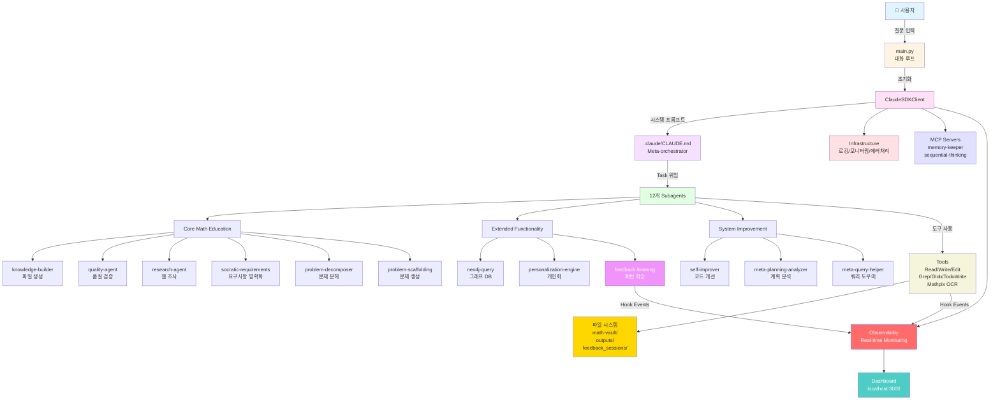

---

## 2. 실행 흐름 (Sequence Diagram)

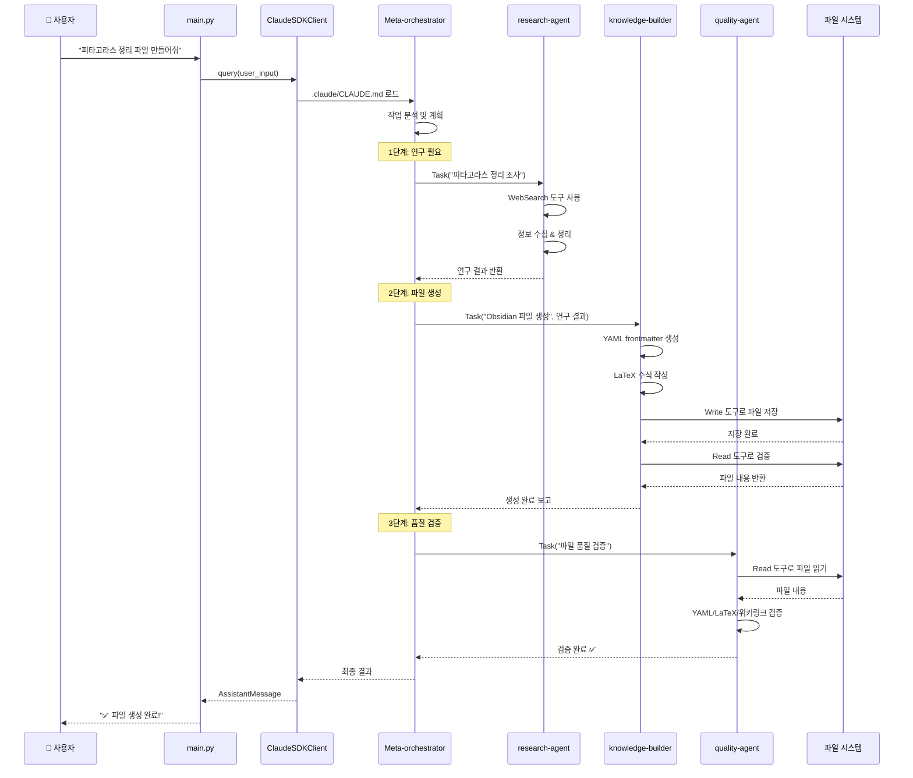

---

## 3. Subagent 계층 구조

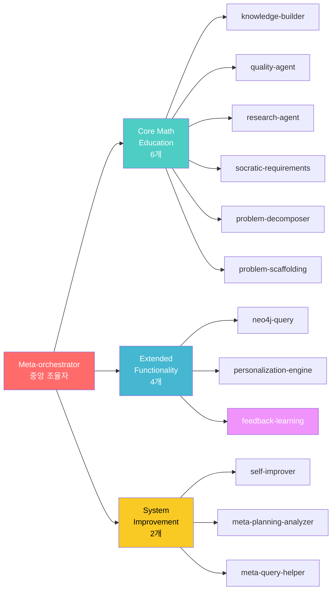

---

## 4. 데이터 흐름 (Data Flow)

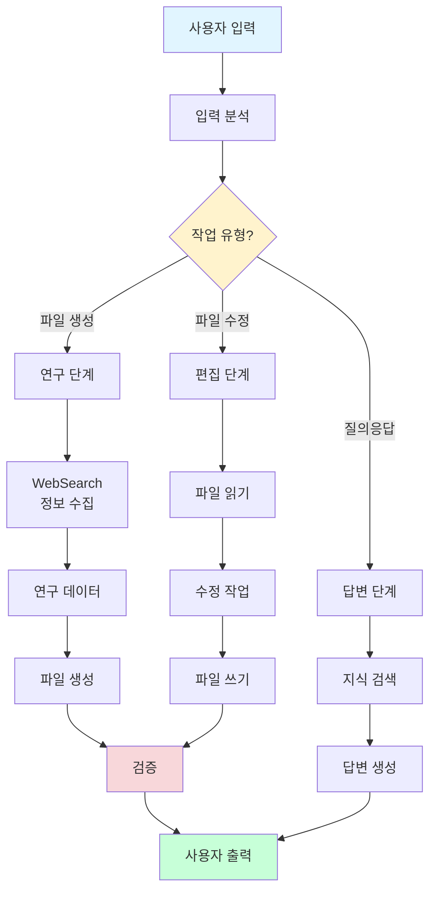

---

## 5. Infrastructure 서비스

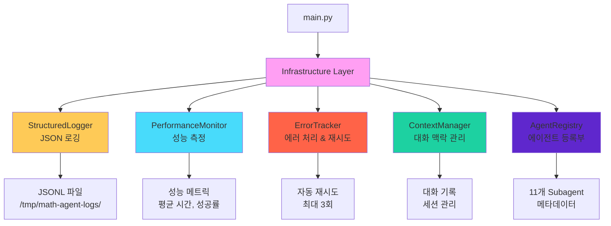

---

## 6. 파일 생성 워크플로우

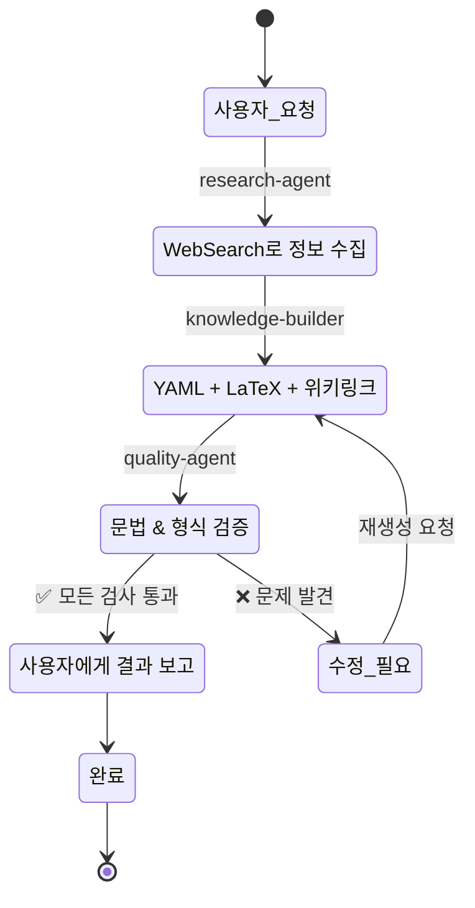

---

## 7. Tool 사용 권한

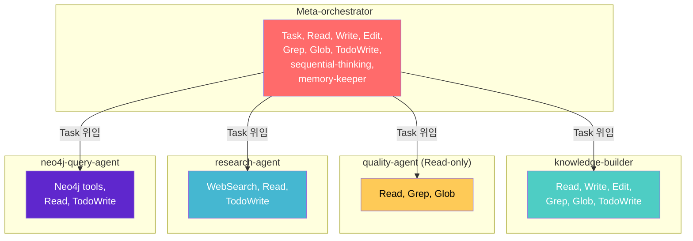

**설명**:
- **Meta-orchestrator**: 최대 권한 (Task 포함)
- **knowledge-builder**: 파일 생성/수정 가능
- **quality-agent**: 읽기 전용 (least-privilege)
- **research-agent**: 웹 검색 전문
- **neo4j-query-agent**: 그래프 DB 전문

---

## 8. 로그 구조 (Log Entry)

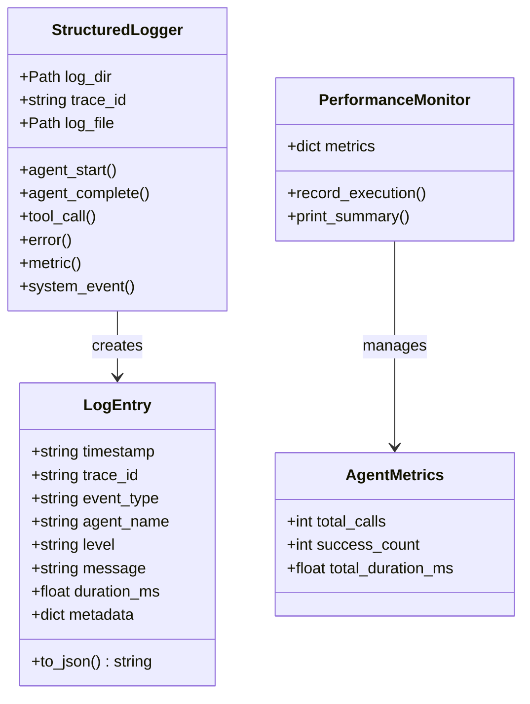

---

## 9. AgentDefinition 구조

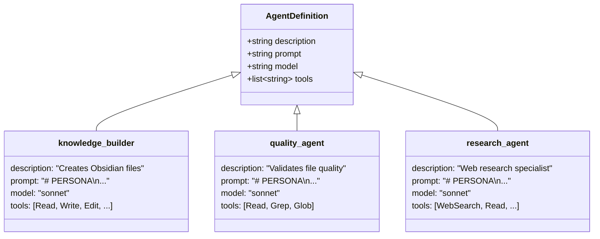

---

## 10. 비동기 실행 모델

```mermaid
sequenceDiagram
    participant Main as main.py
    participant Loop as asyncio Event Loop
    participant Client as ClaudeSDKClient
    participant Agent1 as research-agent
    participant Agent2 as knowledge-builder

    Main->>Loop: asyncio.run(main())
    Loop->>Main: 이벤트 루프 시작

    Main->>Client: await client.query()
    Client->>Loop: 비동기 작업 등록

    par 동시 실행 가능
        Loop->>Agent1: Task 실행
        Agent1->>Agent1: WebSearch (I/O 대기)
    and
        Loop->>Main: 다른 작업 가능
    end

    Agent1-->>Loop: 완료
    Loop->>Agent2: Task 실행
    Agent2->>Agent2: Write 파일
    Agent2-->>Loop: 완료

    Loop-->>Client: 모든 작업 완료
    Client-->>Main: 결과 반환
    Main-->>Loop: 다음 입력 대기
```

**비동기의 장점**:
- I/O 대기 시간에 다른 작업 가능
- 여러 agent를 동시에 실행 가능
- 응답성 향상 (사용자가 기다리는 시간 감소)

---

## 11. Config 경로 설정

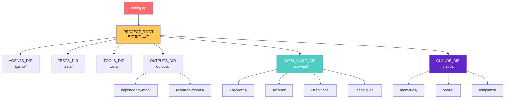

---

## 12. MCP Server 연결

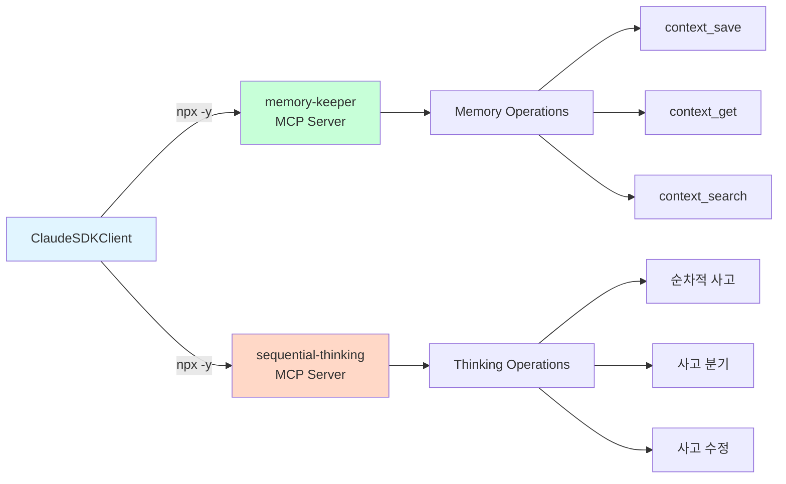

**MCP (Model Context Protocol)**:
- AI가 외부 서비스와 통신하는 표준
- npx로 실행되는 독립 프로세스
- stdin/stdout으로 JSON-RPC 통신

---

## 13. 에러 처리 흐름

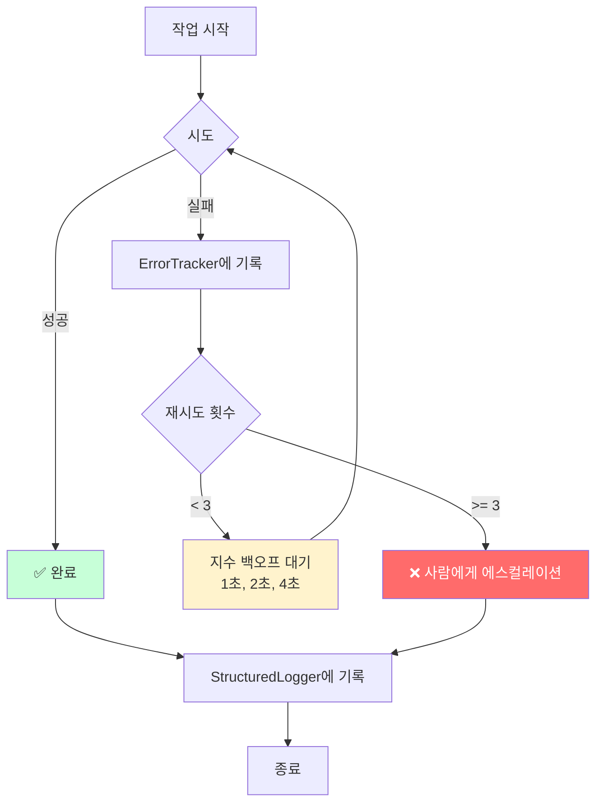

**지수 백오프 (Exponential Backoff)**:
```python
for attempt in range(max_retries):
    try:
        return await task()
    except Exception:
        await asyncio.sleep(2 ** attempt)  # 1초 → 2초 → 4초
```

---

## 14. 전체 시스템 레이어

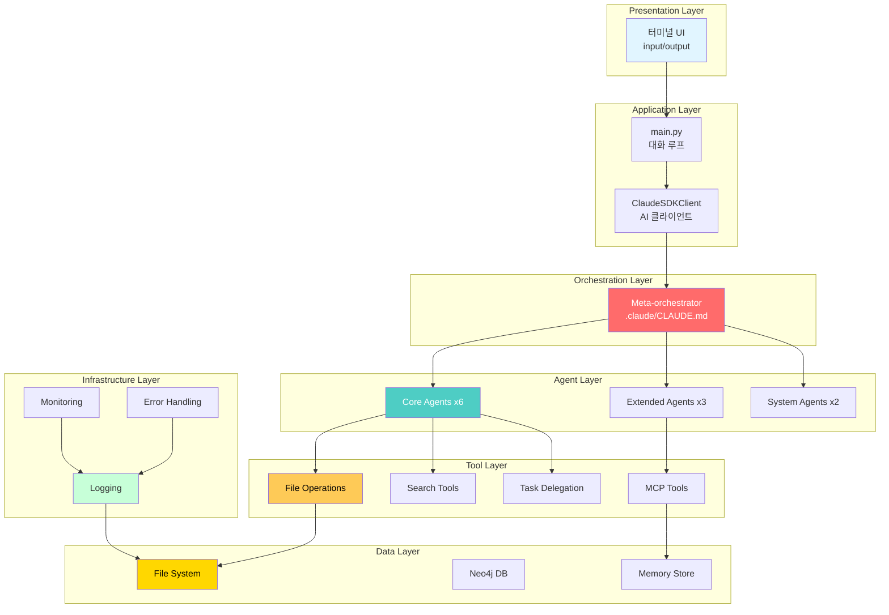

---

## 15. Task 위임 메커니즘

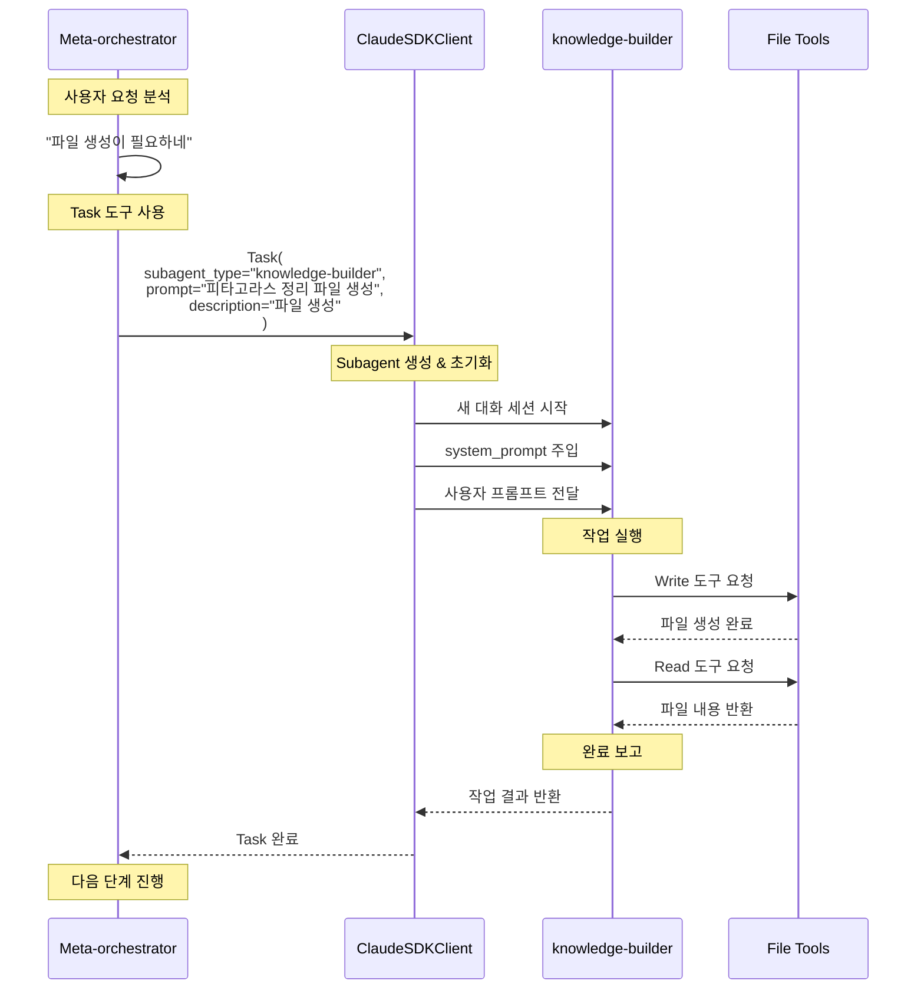

**핵심**:
- Meta-orchestrator는 `Task` 도구로 subagent를 호출
- 각 subagent는 독립된 대화 세션
- Subagent는 자신의 tools만 사용 가능
- 결과는 다시 meta-orchestrator로 반환

---

## 요약

### 핵심 패턴

1. **Kenneth-Liao Pattern**: ClaudeSDKClient + AgentDefinition
2. **Delegation**: Meta-orchestrator → Task → Subagents
3. **Least Privilege**: 각 agent는 필요한 tools만
4. **Observability**: 로깅 + 모니터링 + 에러 추적
5. **Async/Await**: 비동기 처리로 성능 향상

### 실행 흐름 요약

```
사용자 → main.py → ClaudeSDKClient → Meta-orchestrator
  → Task(research-agent) → 연구 결과
  → Task(knowledge-builder) → 파일 생성
  → Task(quality-agent) → 검증
  → 사용자에게 결과 출력
```

### 주요 디렉토리

```
/home/kc-palantir/math/
├── main.py              ← 진입점
├── subagents/           ← 11개 전문 AI
├── infrastructure/      ← 시스템 지원
├── tools/               ← 유틸리티
├── .claude/CLAUDE.md    ← Meta-orchestrator 프롬프트
└── config.py            ← 경로 설정
```

---

## 16. Feedback Loop Workflow (NEW)

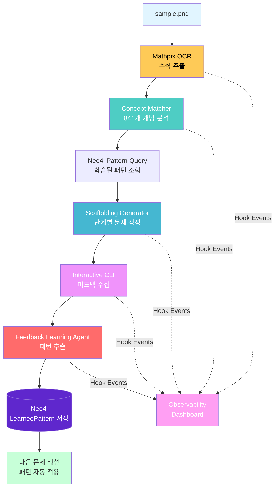

**Feedback Loop 특징**:
- OCR Confidence: 99.9% (Mathpix API)
- Concept Matching: 841개 중학교 수학 개념
- Scaffolding: 문제 유형별 최적화 (좌표평면, 소인수분해 등)
- Real-time Observability: 모든 단계 실시간 추적

---

## 17. Enhanced Observability (indydevdan Integration)

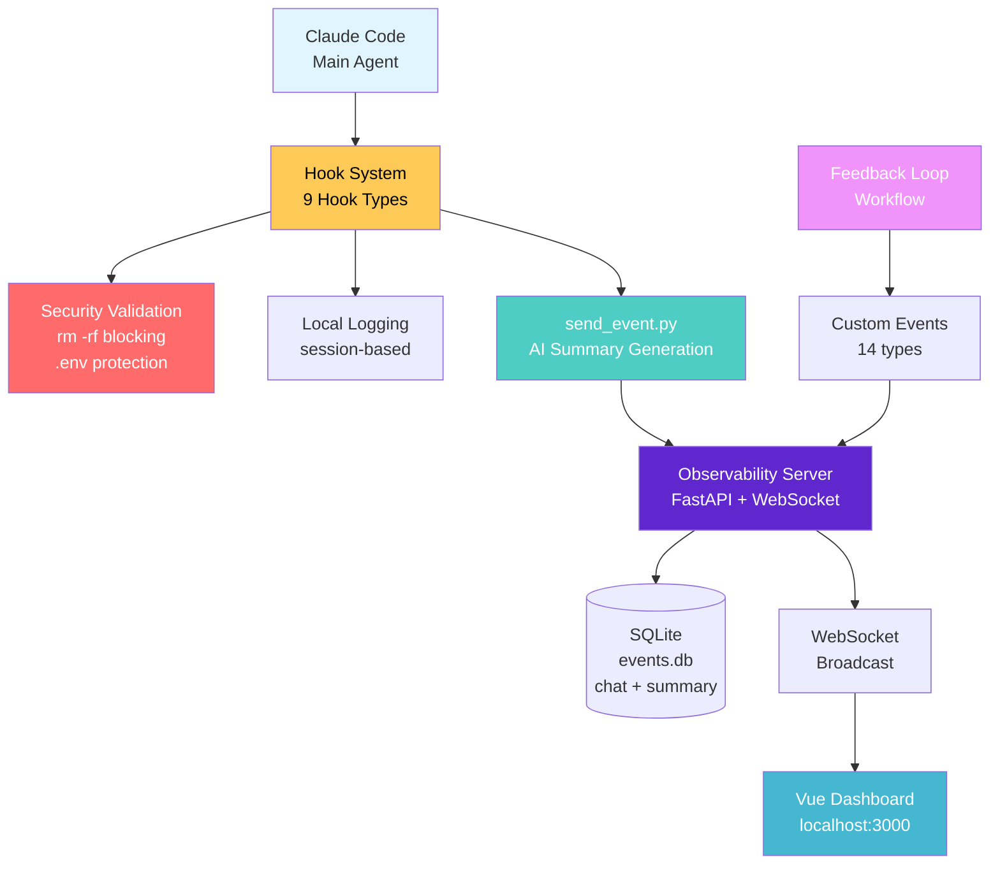

**Integration Features**:
- Hook Scripts: 19 scripts (indydevdan + existing)
- Hook Types: 9 types (PreToolUse, PostToolUse, Stop, etc.)
- Security: rm -rf blocking, .env file protection
- AI Summaries: Anthropic Haiku-generated event summaries
- WebSocket: Real-time event streaming
- Backward Compatible: 100% existing tests passing

---

---

## 18. Infinite Agentic Feedback Loop (NEW - 2025-10-16)

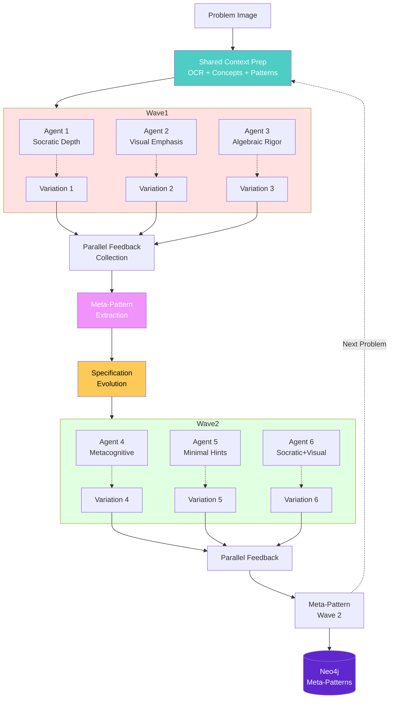

### Key Innovations

**Parallel Execution**:
- 3-7 variations generated simultaneously per wave
- Shared context reuse (OCR, concepts, patterns)
- asyncio.gather() for true parallelism
- <1 second for 3 variations

**Variation Dimensions (7)**:
1. Socratic Depth - Question-based discovery
2. Visual Emphasis - Geometric/graphical thinking
3. Algebraic Rigor - Symbolic manipulation
4. Metacognitive - "Why" questions & strategy
5. Minimal Hints - Challenge mode
6. Conceptual Bridges - Cross-concept connections
7. Real-World - Application contexts

**Meta-Pattern Learning**:
- Extract patterns FROM patterns
- Dimension effectiveness analysis
- Optimal step count discovery
- Pedagogical combination synergies

---

## 19. Parallel Workflow Timeline

```mermaid
gantt
    title Infinite Scaffolding Loop - 2 Waves (6 Variations)
    dateFormat  ss
    axisFormat %S
    
    section Preparation
    Shared Context (OCR + Concepts)    :done, prep, 00, 01s
    
    section Wave 1
    Agent 1: Socratic     :active, a1, 01, 01s
    Agent 2: Visual       :active, a2, 01, 01s
    Agent 3: Algebraic    :active, a3, 01, 01s
    Parallel Feedback     :done, fb1, 02, 01s
    Meta-Pattern Extract  :done, mp1, 03, 01s
    Spec Evolution        :done, se1, 04, 01s
    
    section Wave 2
    Agent 4: Metacognitive :active, a4, 05, 01s
    Agent 5: Minimal Hints :active, a5, 05, 01s
    Agent 6: Socratic+Visual :active, a6, 05, 01s
    Parallel Feedback     :done, fb2, 06, 01s
    Meta-Pattern Extract  :done, mp2, 07, 01s
    Final Synthesis       :done, syn, 08, 01s
```

**Timeline Benefits**:
- Total time: ~8 seconds for 6 variations
- Sequential would be: ~30 seconds (4x slower)
- Parallel feedback: All variations rated simultaneously
- Progressive sophistication: Wave 2 builds on Wave 1 learnings

---

## 20. Variation Dimension Matrix

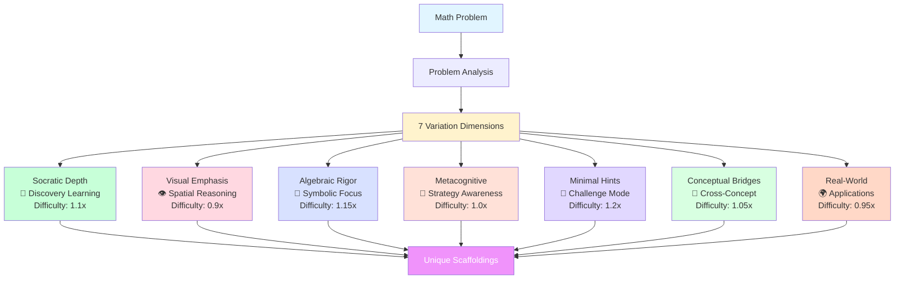

---

## 21. Meta-Pattern Extraction Flow

```mermaid
sequenceDiagram
    participant Vars as 6 Variations
    participant Feedback as Parallel Feedback
    participant Extractor as Meta-Pattern Extractor
    participant Analysis as Pattern Analysis
    participant Neo4j as Neo4j Storage
    
    Vars->>Feedback: Submit all variations
    Feedback->>Feedback: Collect ratings (1-5)
    Feedback->>Feedback: Collect comments
    
    Feedback->>Extractor: Feedback results
    Extractor->>Analysis: Analyze dimension effectiveness
    Analysis-->>Extractor: Top dimensions: Socratic (4.6), Visual (4.5)
    
    Extractor->>Analysis: Analyze step sequences
    Analysis-->>Extractor: Optimal: 8.3 steps average
    
    Extractor->>Analysis: Analyze hint strategies
    Analysis-->>Extractor: Minimal hints rated higher for advanced
    
    Extractor->>Neo4j: Store meta-patterns
    Neo4j-->>Extractor: :MetaPattern nodes created
    
    Note over Extractor,Neo4j: Meta-patterns guide next wave
```

---

## 22. Complete System with Infinite Loop

```mermaid
graph TB
    subgraph "User Interface"
        CLI[CLI Input]
        Dashboard[Vue Dashboard<br/>localhost:5173]
    end
    
    subgraph "Main System"
        Main[main.py]
        MetaOrch[Meta-orchestrator<br/>.claude/CLAUDE.md]
    end
    
    subgraph "Parallel Execution Layer NEW"
        ParallelOrch[ParallelScaffoldingOrchestrator]
        VarEngine[VariationEngine<br/>7 Dimensions]
        InfiniteLoop[InfiniteFeedbackLoop]
    end
    
    subgraph "Original Workflows"
        MathScaff[MathScaffoldingWorkflow<br/>Single scaffolding]
        ConceptMatch[ConceptMatcher<br/>841 concepts]
        OCR[Mathpix OCR]
    end
    
    subgraph "Learning & Storage"
        MetaExtractor[MetaPatternExtractor]
        SpecEvolution[SpecificationEvolution]
        Neo4j[(Neo4j<br/>Patterns + Meta-Patterns)]
    end
    
    subgraph "Observability"
        ObsServer[Observability Server<br/>8 new event types]
        ObsDB[(SQLite<br/>50+ events)]
    end
    
    CLI --> Main
    Main --> MetaOrch
    MetaOrch --> ParallelOrch
    MetaOrch --> MathScaff
    
    ParallelOrch --> VarEngine
    ParallelOrch --> OCR
    ParallelOrch --> ConceptMatch
    ParallelOrch --> InfiniteLoop
    
    InfiniteLoop --> MetaExtractor
    InfiniteLoop --> SpecEvolution
    
    MetaExtractor --> Neo4j
    SpecEvolution --> Neo4j
    
    ParallelOrch -.->|Events| ObsServer
    InfiniteLoop -.->|Events| ObsServer
    ObsServer --> ObsDB
    ObsServer -.->|WebSocket| Dashboard
    
    style ParallelOrch fill:#ff6b6b,color:#fff
    style VarEngine fill:#4ecdc4,color:#fff
    style InfiniteLoop fill:#f093fb,color:#fff
    style MetaExtractor fill:#feca57,color:#000
    style ObsServer fill:#45b7d1,color:#fff
    style Dashboard fill:#5f27cd,color:#fff
```

---

**문서 버전**: 4.0.0 - Infinite Agentic Loop Integration
**작성일**: 2025-10-16
**업데이트**: Parallel scaffolding generation, wave-based execution, meta-pattern learning, 8 new event types
**대상**: 시각적 학습자
