# 시스템 아키텍처 다이어그램 모음

> **Mermaid 다이어그램**으로 시각화한 시스템 구조
> GitHub, Obsidian, Visual Studio Code에서 자동으로 렌더링됩니다.

---

## 1. 전체 시스템 아키텍처


---

## 2. 실행 흐름 (Sequence Diagram)

```mermaid
sequenceDiagram
    participant U as 👤 사용자
    participant M as main.py
    participant C as ClaudeSDKClient
    participant O as Meta-orchestrator
    participant R as research-agent
    participant K as knowledge-builder
    participant Q as quality-agent
    participant F as 파일 시스템

    U->>M: "피타고라스 정리 파일 만들어줘"
    M->>C: query(user_input)
    C->>O: .claude/CLAUDE.md 로드
    O->>O: 작업 분석 및 계획

    Note over O: 1단계: 연구 필요
    O->>R: Task("피타고라스 정리 조사")
    R->>R: WebSearch 도구 사용
    R->>R: 정보 수집 & 정리
    R-->>O: 연구 결과 반환

    Note over O: 2단계: 파일 생성
    O->>K: Task("Obsidian 파일 생성", 연구 결과)
    K->>K: YAML frontmatter 생성
    K->>K: LaTeX 수식 작성
    K->>F: Write 도구로 파일 저장
    F-->>K: 저장 완료
    K->>F: Read 도구로 검증
    F-->>K: 파일 내용 반환
    K-->>O: 생성 완료 보고

    Note over O: 3단계: 품질 검증
    O->>Q: Task("파일 품질 검증")
    Q->>F: Read 도구로 파일 읽기
    F-->>Q: 파일 내용
    Q->>Q: YAML/LaTeX/위키링크 검증
    Q-->>O: 검증 완료 ✅

    O-->>C: 최종 결과
    C-->>M: AssistantMessage
    M-->>U: "✅ 파일 생성 완료!"
```



---

## 3. Subagent 계층 구조


---

## 4. 데이터 흐름 (Data Flow)

```mermaid
flowchart TD
    Input[사용자 입력] --> Parse[입력 분석]
    Parse --> Decision{작업 유형?}

    Decision -->|파일 생성| Research[연구 단계]
    Decision -->|파일 수정| Edit[편집 단계]
    Decision -->|질의응답| QA[답변 단계]

    Research --> WebSearch[WebSearch<br/>정보 수집]
    WebSearch --> Data[연구 데이터]
    Data --> FileGen[파일 생성]
    FileGen --> Validate[검증]
    Validate --> Output[사용자 출력]

    Edit --> ReadFile[파일 읽기]
    ReadFile --> Modify[수정 작업]
    Modify --> WriteFile[파일 쓰기]
    WriteFile --> Validate

    QA --> SearchKnowledge[지식 검색]
    SearchKnowledge --> Answer[답변 생성]
    Answer --> Output

    style Input fill:#e1f5ff
    style Output fill:#c7ffd8
    style Decision fill:#fff3cd
    style Validate fill:#f8d7da
```



---

## 5. Infrastructure 서비스

```mermaid
graph TB
    Main[main.py] --> Infra[Infrastructure Layer]

    Infra --> Logger[StructuredLogger<br/>JSON 로깅]
    Infra --> Monitor[PerformanceMonitor<br/>성능 측정]
    Infra --> Error[ErrorTracker<br/>에러 처리 & 재시도]
    Infra --> Context[ContextManager<br/>대화 맥락 관리]
    Infra --> Registry[AgentRegistry<br/>에이전트 등록부]

    Logger --> LogFile[JSONL 파일<br/>/tmp/math-agent-logs/]
    Monitor --> Metrics[성능 메트릭<br/>평균 시간, 성공률]
    Error --> Retry[자동 재시도<br/>최대 3회]
    Context --> Memory[대화 기록<br/>세션 관리]
    Registry --> Agents[11개 Subagent<br/>메타데이터]

    style Infra fill:#ff9ff3
    style Logger fill:#feca57
    style Monitor fill:#48dbfb
    style Error fill:#ff6348
    style Context fill:#1dd1a1
    style Registry fill:#5f27cd
```



---

## 6. 파일 생성 워크플로우

```mermaid
stateDiagram-v2
    [*] --> 사용자_요청
    사용자_요청 --> 연구_단계: research-agent
    연구_단계 --> 파일_생성: knowledge-builder
    파일_생성 --> 품질_검증: quality-agent
    품질_검증 --> 검증_통과: ✅ 모든 검사 통과
    품질_검증 --> 수정_필요: ❌ 문제 발견
    수정_필요 --> 파일_생성: 재생성 요청
    검증_통과 --> 완료
    완료 --> [*]

    연구_단계: WebSearch로 정보 수집
    파일_생성: YAML + LaTeX + 위키링크
    품질_검증: 문법 & 형식 검증
    검증_통과: 사용자에게 결과 보고
```



---

## 7. Tool 사용 권한


**설명**:
- **Meta-orchestrator**: 최대 권한 (Task 포함)
- **knowledge-builder**: 파일 생성/수정 가능
- **quality-agent**: 읽기 전용 (least-privilege)
- **research-agent**: 웹 검색 전문
- **neo4j-query-agent**: 그래프 DB 전문

---

## 8. 로그 구조 (Log Entry)


---

## 9. AgentDefinition 구조


---

## 10. 비동기 실행 모델

```mermaid
sequenceDiagram
    participant Main as main.py
    participant Loop as asyncio Event Loop
    participant Client as ClaudeSDKClient
    participant Agent1 as research-agent
    participant Agent2 as knowledge-builder

    Main->>Loop: asyncio.run(main())
    Loop->>Main: 이벤트 루프 시작

    Main->>Client: await client.query()
    Client->>Loop: 비동기 작업 등록

    par 동시 실행 가능
        Loop->>Agent1: Task 실행
        Agent1->>Agent1: WebSearch (I/O 대기)
    and
        Loop->>Main: 다른 작업 가능
    end

    Agent1-->>Loop: 완료
    Loop->>Agent2: Task 실행
    Agent2->>Agent2: Write 파일
    Agent2-->>Loop: 완료

    Loop-->>Client: 모든 작업 완료
    Client-->>Main: 결과 반환
    Main-->>Loop: 다음 입력 대기
```

**비동기의 장점**:
- I/O 대기 시간에 다른 작업 가능
- 여러 agent를 동시에 실행 가능
- 응답성 향상 (사용자가 기다리는 시간 감소)

---

## 11. Config 경로 설정


---

## 12. MCP Server 연결

```mermaid
graph LR
    Client[ClaudeSDKClient] -->|npx -y| MK[memory-keeper<br/>MCP Server]
    Client -->|npx -y| ST[sequential-thinking<br/>MCP Server]

    MK --> MemOps[Memory Operations]
    MemOps --> Save[context_save]
    MemOps --> Get[context_get]
    MemOps --> Search[context_search]

    ST --> ThinkOps[Thinking Operations]
    ThinkOps --> Sequential[순차적 사고]
    ThinkOps --> Branch[사고 분기]
    ThinkOps --> Revision[사고 수정]

    style Client fill:#e1f5ff
    style MK fill:#c7ffd8
    style ST fill:#ffd8c7
```



**MCP (Model Context Protocol)**:
- AI가 외부 서비스와 통신하는 표준
- npx로 실행되는 독립 프로세스
- stdin/stdout으로 JSON-RPC 통신

---

## 13. 에러 처리 흐름

```mermaid
flowchart TD
    Start[작업 시작] --> Try{시도}
    Try -->|성공| Success[✅ 완료]
    Try -->|실패| Record[ErrorTracker에 기록]

    Record --> Count{재시도 횟수}
    Count -->|< 3| Wait[지수 백오프 대기<br/>1초, 2초, 4초]
    Count -->|>= 3| Escalate[❌ 사람에게 에스컬레이션]

    Wait --> Try

    Success --> Log[StructuredLogger에 기록]
    Escalate --> Log

    Log --> End[종료]

    style Success fill:#c7ffd8
    style Escalate fill:#ff6b6b,color:#fff
    style Wait fill:#fff3cd
```



**지수 백오프 (Exponential Backoff)**:
```python
for attempt in range(max_retries):
    try:
        return await task()
    except Exception:
        await asyncio.sleep(2 ** attempt)  # 1초 → 2초 → 4초
```

---

## 14. 전체 시스템 레이어


---

## 15. Task 위임 메커니즘

```mermaid
sequenceDiagram
    participant MO as Meta-orchestrator
    participant SDK as ClaudeSDKClient
    participant KB as knowledge-builder
    participant Tools as File Tools

    Note over MO: 사용자 요청 분석
    MO->>MO: "파일 생성이 필요하네"

    Note over MO: Task 도구 사용
    MO->>SDK: Task(<br/>  subagent_type="knowledge-builder",<br/>  prompt="피타고라스 정리 파일 생성",<br/>  description="파일 생성"<br/>)

    Note over SDK: Subagent 생성 & 초기화
    SDK->>KB: 새 대화 세션 시작
    SDK->>KB: system_prompt 주입
    SDK->>KB: 사용자 프롬프트 전달

    Note over KB: 작업 실행
    KB->>Tools: Write 도구 요청
    Tools-->>KB: 파일 생성 완료
    KB->>Tools: Read 도구 요청
    Tools-->>KB: 파일 내용 반환

    Note over KB: 완료 보고
    KB-->>SDK: 작업 결과 반환
    SDK-->>MO: Task 완료

    Note over MO: 다음 단계 진행
```



**핵심**:
- Meta-orchestrator는 `Task` 도구로 subagent를 호출
- 각 subagent는 독립된 대화 세션
- Subagent는 자신의 tools만 사용 가능
- 결과는 다시 meta-orchestrator로 반환

---

## 요약

### 핵심 패턴

1. **Kenneth-Liao Pattern**: ClaudeSDKClient + AgentDefinition
2. **Delegation**: Meta-orchestrator → Task → Subagents
3. **Least Privilege**: 각 agent는 필요한 tools만
4. **Observability**: 로깅 + 모니터링 + 에러 추적
5. **Async/Await**: 비동기 처리로 성능 향상

### 실행 흐름 요약

```
사용자 → main.py → ClaudeSDKClient → Meta-orchestrator
  → Task(research-agent) → 연구 결과
  → Task(knowledge-builder) → 파일 생성
  → Task(quality-agent) → 검증
  → 사용자에게 결과 출력
```

### 주요 디렉토리

```
/home/kc-palantir/math/
├── main.py              ← 진입점
├── subagents/           ← 11개 전문 AI
├── infrastructure/      ← 시스템 지원
├── tools/               ← 유틸리티
├── .claude/CLAUDE.md    ← Meta-orchestrator 프롬프트
└── config.py            ← 경로 설정
```

---

## 16. Feedback Loop Workflow (NEW)

```mermaid
flowchart TD
    Image[sample.png] --> OCR[Mathpix OCR<br/>수식 추출]
    OCR --> ConceptMatch[Concept Matcher<br/>841개 개념 분석]
    ConceptMatch --> PatternQuery[Neo4j Pattern Query<br/>학습된 패턴 조회]
    PatternQuery --> Scaffolding[Scaffolding Generator<br/>단계별 문제 생성]
    Scaffolding --> Feedback[Interactive CLI<br/>피드백 수집]
    Feedback --> Learning[Feedback Learning Agent<br/>패턴 추출]
    Learning --> Neo4j[(Neo4j<br/>LearnedPattern 저장)]
    Neo4j --> NextCycle[다음 문제 생성<br/>패턴 자동 적용]
    
    OCR -.->|Hook Events| Obs[Observability<br/>Dashboard]
    ConceptMatch -.->|Hook Events| Obs
    Scaffolding -.->|Hook Events| Obs
    Feedback -.->|Hook Events| Obs
    Learning -.->|Hook Events| Obs
    
    style Image fill:#e1f5ff
    style OCR fill:#feca57,color:#000
    style ConceptMatch fill:#4ecdc4,color:#fff
    style Scaffolding fill:#45b7d1,color:#fff
    style Feedback fill:#f093fb,color:#fff
    style Learning fill:#ff6b6b,color:#fff
    style Neo4j fill:#5f27cd,color:#fff
    style Obs fill:#ff9ff3,color:#fff
    style NextCycle fill:#c7ffd8
```



**Feedback Loop 특징**:
- OCR Confidence: 99.9% (Mathpix API)
- Concept Matching: 841개 중학교 수학 개념
- Scaffolding: 문제 유형별 최적화 (좌표평면, 소인수분해 등)
- Real-time Observability: 모든 단계 실시간 추적

---

## 17. Enhanced Observability (indydevdan Integration)


**Integration Features**:
- Hook Scripts: 19 scripts (indydevdan + existing)
- Hook Types: 9 types (PreToolUse, PostToolUse, Stop, etc.)
- Security: rm -rf blocking, .env file protection
- AI Summaries: Anthropic Haiku-generated event summaries
- WebSocket: Real-time event streaming
- Backward Compatible: 100% existing tests passing

---

**문서 버전**: 3.2.0 - indydevdan Observability Integration
**작성일**: 2025-10-16
**업데이트**: indydevdan Claude Code hooks 통합 (19 hook scripts, WebSocket, AI summaries)
**대상**: 시각적 학습자
