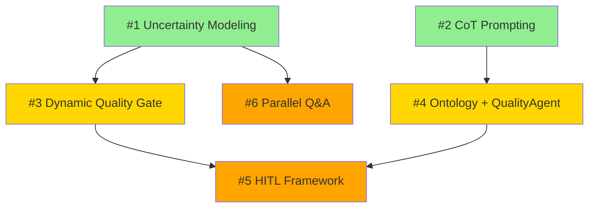

# Improvement Dependency Graph

**Version**: 1.0
**Date**: 2025-10-14
**Purpose**: Visual dependency structure and recommended implementation sequence

---

## Overview

6 improvements have dependencies that affect implementation order:
- **Independent**: Can be implemented in parallel
- **Sequential**: Must wait for predecessor completion
- **Synergistic**: Benefit from combined implementation

---

## Dependency Map



**Legend**:
- 🟢 Green: Phase 1 (Critical, no dependencies)
- 🟡 Yellow: Phase 2 (High priority, depends on Phase 1)
- 🟠 Orange: Phase 3 (Medium priority, depends on Phase 2)

---

## Detailed Dependencies

### #1 Uncertainty Modeling → #3 Dynamic Quality Gate

**Dependency Type**: Enhancing
**Reason**: Uncertainty metrics improve quality gate decisions

**Connection**:
- #1 provides `uncertainty_breakdown` with epistemic/aleatoric/model scores
- #3 can use uncertainty metrics as additional quality signals
- Example: High epistemic uncertainty → Request human review

**Implementation Order**: #1 first, then #3
**Can #3 work without #1?**: Yes, but less sophisticated

**Enhanced Integration** (optional):
```python
# In agents/criticality_config.py (Improvement #3)

def calculate_dynamic_thresholds(
    affected_files: List[str],
    uncertainty_metrics: Optional[Dict] = None  # From #1
) -> Dict[str, float]:
    """Enhanced with uncertainty awareness"""

    # Base thresholds
    thresholds = {...}

    # If uncertainty data available (from #1)
    if uncertainty_metrics:
        avg_epistemic = uncertainty_metrics.get("avg_epistemic", 0)

        # High epistemic uncertainty → stricter gate
        if avg_epistemic > 0.30:
            thresholds["coverage_threshold"] += 0.05
            thresholds["verification_rounds"] += 1

    return thresholds
```

---

### #1 Uncertainty Modeling → #6 Parallel Q&A

**Dependency Type**: Enabling
**Reason**: Uncertainty diagnostics determine which questions to ask

**Connection**:
- #1 provides `uncertainty_reason` codes
- #6 uses parallel Task calls to ask multiple diagnostic questions
- Example: `"concept_B_context_insufficient"` → Ask 3 questions about concept B in parallel

**Implementation Order**: #1 first, then #6
**Can #6 work without #1?**: Yes, but questions will be generic (not targeted)

**Enhanced Integration**:
```python
# In agents/socratic_mediator_agent.py (Improvement #6)

def generate_diagnostic_questions(self, uncertainty_data: Dict) -> List[str]:
    """Generate targeted questions based on uncertainty_reason"""

    reason = uncertainty_data.get("uncertainty_reason")
    questions = []

    if reason == "concept_B_context_insufficient":
        questions = [
            "What is the precise mathematical definition of concept B?",
            "In what educational contexts is concept B typically taught?",
            "What prerequisites are required before introducing concept B?"
        ]
    elif reason == "boundary_ambiguous_between_TYPE1_TYPE2":
        questions = [
            f"What distinguishes {TYPE1} from {TYPE2} relationships?",
            "Can both types apply simultaneously?",
            "What are canonical examples of each type?"
        ]

    # Ask all questions in parallel (Improvement #6)
    return self.ask_parallel(questions)
```

---

### #2 CoT Prompting → #4 Ontology + QualityAgent

**Dependency Type**: Enhancing
**Reason**: Reasoning traces help debug ontology violations

**Connection**:
- #2 provides `reasoning_trace` with step-by-step analysis
- #4 detects violations (circular dependencies, symmetry issues)
- Combination: When QualityAgent finds error, reasoning_trace shows where logic went wrong

**Implementation Order**: #2 first, then #4
**Can #4 work without #2?**: Yes, but errors are harder to debug

**Enhanced Integration**:
```python
# In agents/quality_agent.py (Improvement #4)

def validate_with_reasoning(self, relationship: Dict) -> Dict:
    """Enhanced validation with CoT debugging"""

    # Run ontology validation
    errors = validate_relationship_logic(...)

    if errors and "reasoning_trace" in relationship:
        # Extract reasoning trace (from #2)
        reasoning = relationship["reasoning_trace"]

        # Identify which reasoning step caused the error
        error_analysis = self.diagnose_reasoning_error(reasoning, errors)

        return {
            "errors": errors,
            "reasoning_trace": reasoning,
            "error_source": error_analysis.failed_step,
            "fix_suggestion": error_analysis.suggestion
        }

    return {"errors": errors}
```

---

### #3 Dynamic Quality Gate → #5 HITL Framework

**Dependency Type**: Sequential
**Reason**: HITL checkpoints should respect quality gate decisions

**Connection**:
- #3 evaluates improvement risk (based on criticality)
- #5 triggers human checkpoints for high-risk decisions
- Example: If #3 detects high criticality + failed gate → #5 triggers HITL checkpoint

**Implementation Order**: #3 first, then #5
**Can #5 work without #3?**: Yes, but checkpoint triggers will be less informed

**Integration**:
```python
# In agents/meta_orchestrator.py

def should_trigger_hitl_checkpoint(
    self,
    improvement: Improvement,
    quality_gate_result: QualityGateApproval  # From #3
) -> bool:
    """HITL decision based on quality gate (Improvement #5)"""

    # High-risk failure → Trigger HITL
    if not quality_gate_result.passed:
        criticality = quality_gate_result.metrics.get("max_criticality", 5)
        if criticality >= 9:
            return True  # Human review required

    # Other HITL conditions...
    return False
```

---

### #4 Ontology + QualityAgent → #5 HITL Framework

**Dependency Type**: Sequential
**Reason**: HITL should review ontology modifications

**Connection**:
- #4 defines relationship formal properties
- #5 checkpoints critical ontology changes
- Example: Adding new relationship type → #4 requires ontology update → #5 triggers human review

**Implementation Order**: #4 first, then #5
**Can #5 work without #4?**: Yes, but less critical decisions to review

**Integration**:
```python
# In agents/hitl_checkpoints.py (Improvement #5)

def is_ontology_modification(self, improvement: Improvement) -> bool:
    """Detect ontology changes that need review"""

    ontology_files = [
        "agents/relationship_ontology.py",  # From #4
        "agents/quality_agent.py"           # From #4
    ]

    affected = improvement.affected_files

    # If ontology files modified → Trigger HITL
    if any(f in affected for f in ontology_files):
        return True

    # If new relationship type proposed → Trigger HITL
    if improvement.type == "new_relationship_type":
        return True

    return False
```

---

## Implementation Sequences

### Sequence 1: Fastest Delivery (Parallel Where Possible)

```
Week 1:
├─ Day 1-2: #1 Uncertainty (no dependencies) ✅
└─ Day 1-2: #2 CoT (no dependencies) ✅ [PARALLEL with #1]

Week 2:
├─ Day 1-3: #3 Dynamic Gate (depends on #1) ⚠️ Wait for #1
└─ Day 1-4: #4 Ontology (depends on #2) ⚠️ Wait for #2

Week 3:
├─ Day 1-2: #6 Parallel Q&A (depends on #1) ✅ Can start after #1
└─ Day 3-5: #5 HITL (depends on #3, #4) ⚠️ Wait for both

Total: 3 weeks
```

**Critical Path**: #2 → #4 → #5 (longest chain)
**Parallelizable**: #1, #2 (Week 1) | #3, #4 (Week 2)

---

### Sequence 2: Risk-Minimized (Sequential, One at a Time)

```
Week 1: #1 Uncertainty
Week 2: #2 CoT
Week 3: #3 Dynamic Gate
Week 4-5: #4 Ontology
Week 6-7: #5 HITL
Week 8: #6 Parallel Q&A

Total: 8 weeks
```

**Pros**: Each improvement fully tested before next
**Cons**: Slowest delivery
**Best for**: High-risk production environments

---

### Sequence 3: Phased by Priority (Recommended)

```
Phase 1 (Critical - Week 1-2):
├─ #1 Uncertainty (Days 1-3)
└─ #2 CoT (Days 4-7) [Can overlap #1 days 1-2]

  ↓ Test Phase 1 (Days 8-10)

Phase 2 (High Priority - Week 3-4):
├─ #3 Dynamic Gate (Days 1-4)
└─ #4 Ontology (Days 5-14) [Can overlap #3]

  ↓ Test Phase 2 (Days 15-17)

Phase 3 (Medium Priority - Week 5-6):
├─ #6 Parallel Q&A (Days 1-3)
└─ #5 HITL (Days 4-14)

  ↓ Full Integration Test (Days 15-17)

Total: 6 weeks
```

**Pros**: Balances speed and safety
**Cons**: Moderate complexity
**Best for**: Most projects ⭐ **RECOMMENDED**

---

## Dependency Risk Analysis

### What if #1 Uncertainty fails?

**Impact**:
- ❌ #3 Dynamic Gate: Loses uncertainty-aware thresholds (minor)
- ❌ #6 Parallel Q&A: Questions become generic (moderate)
- ✅ #2, #4, #5: Unaffected

**Mitigation**: Proceed with #2, #4, #5. Retry #1 later.

---

### What if #2 CoT fails?

**Impact**:
- ❌ #4 Ontology: Loses reasoning trace debugging (moderate)
- ✅ #1, #3, #5, #6: Unaffected

**Mitigation**: Implement #4 without reasoning trace integration. Add later.

---

### What if #3 Dynamic Gate fails?

**Impact**:
- ❌ #5 HITL: Loses quality-gate-informed checkpoints (minor)
- ✅ #1, #2, #4, #6: Unaffected

**Mitigation**: Use static thresholds, proceed with #5.

---

### What if #4 Ontology fails?

**Impact**:
- ❌ #5 HITL: Loses ontology modification checkpoints (minor)
- ✅ #1, #2, #3, #6: Unaffected

**Mitigation**: Proceed with #5 without ontology awareness.

---

### What if #5 HITL fails?

**Impact**:
- ✅ All others: Unaffected (no dependencies on #5)

**Mitigation**: System works without human checkpoints (fully automated).

---

### What if #6 Parallel Q&A fails?

**Impact**:
- ✅ All others: Unaffected (no dependencies on #6)

**Mitigation**: Keep sequential Q&A, system works but slower.

---

## Optimal Implementation Strategy

### Stage 1: Foundation (Week 1-2)

**Goal**: Implement core improvements with no dependencies

```bash
# Week 1-2: Parallel implementation
git checkout -b feature/phase1-critical

# Developer 1: Uncertainty Modeling
cd agents/
# Implement #1...

# Developer 2: CoT Prompting
cd agents/
# Implement #2...

# Both complete → Merge to main
```

**Deliverables**:
- ✅ #1 Uncertainty Modeling
- ✅ #2 CoT Prompting
- ✅ Tests passing
- ✅ Documentation updated

---

### Stage 2: High-Priority Enhancements (Week 3-4)

**Goal**: Implement dependent improvements

```bash
# Week 3-4: Sequential with optional parallelization
git checkout -b feature/phase2-high-priority

# Start #3 (depends on #1 complete)
cd agents/
# Implement #3 Dynamic Gate...

# Optionally parallel: Start #4 (depends on #2 complete)
git checkout -b feature/ontology
# Implement #4 Ontology...

# Merge both to main
```

**Deliverables**:
- ✅ #3 Dynamic Quality Gate
- ✅ #4 Ontology + QualityAgent
- ✅ Integration tests
- ✅ Performance benchmarks

---

### Stage 3: Final Enhancements (Week 5-6)

**Goal**: Implement remaining improvements

```bash
# Week 5-6: Final polish
git checkout -b feature/phase3-medium-priority

# #6 Parallel Q&A (depends on #1)
cd agents/
# Implement #6...

# #5 HITL (depends on #3, #4)
cd agents/
# Implement #5...

# Full system test → Merge
```

**Deliverables**:
- ✅ #6 Parallel Q&A
- ✅ #5 HITL Framework
- ✅ End-to-end validation
- ✅ Production readiness

---

## Dependency Matrix

|  | #1 | #2 | #3 | #4 | #5 | #6 |
|---|:---:|:---:|:---:|:---:|:---:|:---:|
| **#1 Uncertainty** | - | ✅ | ➡️ | ✅ | ✅ | ➡️ |
| **#2 CoT** | ✅ | - | ✅ | ➡️ | ✅ | ✅ |
| **#3 Dynamic Gate** | ⬅️ | ✅ | - | ✅ | ➡️ | ✅ |
| **#4 Ontology** | ✅ | ⬅️ | ✅ | - | ➡️ | ✅ |
| **#5 HITL** | ✅ | ✅ | ⬅️ | ⬅️ | - | ✅ |
| **#6 Parallel** | ⬅️ | ✅ | ✅ | ✅ | ✅ | - |

**Legend**:
- ➡️ : Row depends on column (must implement column first)
- ⬅️ : Column depends on row (must implement row first)
- ✅ : Independent (can implement in any order)

**Reading Guide**:
- Row #3, Column #1: ➡️ means "#3 depends on #1"
- Row #1, Column #3: ⬅️ means "#1 must come before #3"

---

## Quick Reference

### No Dependencies (Can Start Immediately)
- #1 Uncertainty Modeling
- #2 CoT Prompting

### Depends on 1 Improvement
- #3 Dynamic Gate (needs #1)
- #4 Ontology (needs #2)
- #6 Parallel Q&A (needs #1)

### Depends on 2 Improvements
- #5 HITL Framework (needs #3 AND #4)

### No Dependents (Can Be Skipped)
- #6 Parallel Q&A (nothing depends on it)

### Critical Path (Longest Dependency Chain)
**#2 → #4 → #5** (2 dependencies deep)

---

## Recommendations

### For Small Teams (1-2 developers)
→ Use **Sequence 3: Phased by Priority** (6 weeks)
- Implement one phase at a time
- Thorough testing between phases
- Safest approach

### For Medium Teams (3-4 developers)
→ Use **Sequence 1: Fastest Delivery** (3 weeks)
- Parallel Phase 1: 2 developers on #1 and #2
- Parallel Phase 2: 2 developers on #3 and #4
- Sequential Phase 3: #6 then #5

### For Large Teams (5+ developers)
→ Full parallelization with integration coordination
- Week 1: All 6 improvements start (with mock dependencies)
- Week 2-3: Integration and dependency resolution
- Week 4: Full system testing

### For Production Systems
→ Use **Sequence 2: Risk-Minimized** (8 weeks)
- One improvement at a time
- Full production validation before next
- Zero risk of cascading failures

---

## Summary

**Total Improvements**: 6
**Independent**: 2 (#1, #2)
**Dependent**: 4 (#3, #4, #5, #6)
**Maximum Dependency Depth**: 2 levels (#2 → #4 → #5)

**Fastest Possible**: 3 weeks (with parallelization)
**Safest Approach**: 8 weeks (sequential)
**Recommended**: 6 weeks (phased)

**Critical Path**: #2 CoT → #4 Ontology → #5 HITL (10-14 days)
