# Agent Interaction Diagrams

**Date**: 2025-10-15  
**Purpose**: Visual representation of agent dependencies and interactions

---

## 1. Complete Agent Dependency Graph

```mermaid
graph TB
    %% User Layer
    USER[👤 User]
    
    %% Orchestration Layer
    MO[🎯 Meta-Orchestrator<br/>Central Coordinator]
    
    %% Core Agents Layer
    KB[📝 Knowledge-Builder<br/>Markdown Creation]
    QA[✅ Quality-Agent<br/>Validation]
    RA[🔍 Research-Agent<br/>Web Research]
    EG[💡 Example-Generator<br/>Examples & Code]
    DM[🗺️ Dependency-Mapper<br/>Concept Hierarchy]
    SP[❓ Socratic-Planner<br/>Requirements]
    
    %% Self-Improvement Layer
    SM[🔬 Socratic-Mediator<br/>Root Cause Analysis]
    SI[🔧 Self-Improver<br/>Code Modification]
    
    %% Infrastructure Layer
    DA[📊 DependencyAgent<br/>AST Analysis]
    LOG[📋 StructuredLogger]
    PERF[⚡ PerformanceMonitor]
    ERR[❌ ErrorTracker]
    CTX[💾 ContextManager]
    IMP[🔄 ImprovementManager]
    
    %% External Services
    BRAVE[🌐 Brave Search API]
    CTX7[📚 Context7 API]
    MEM[💿 Memory-Keeper MCP]
    SEQ[🧠 Sequential-Thinking MCP]
    
    %% User to Orchestrator
    USER -->|Query| MO
    MO -->|Results| USER
    
    %% Orchestrator to Core Agents (Task delegation)
    MO -.->|Task| KB
    MO -.->|Task| QA
    MO -.->|Task| RA
    MO -.->|Task| EG
    MO -.->|Task| DM
    MO -.->|Task| SP
    MO -.->|Task| SM
    MO -.->|Task| SI
    
    %% Core Agent Data Flow
    RA -->|Research Data| MO
    MO -->|Research Data| KB
    KB -->|File Path| MO
    MO -->|File Path| QA
    QA -->|Validation Report| MO
    KB -->|File Path| EG
    EG -->|Enhanced File| MO
    
    %% Socratic Mediator Q&A
    SM -.->|Task Q&A| KB
    SM -.->|Task Q&A| QA
    SM -.->|Task Q&A| RA
    SM -.->|Task Q&A| EG
    SM -->|Root Cause| MO
    
    %% Self-Improver Modifications
    MO -->|Root Cause + Impact| SI
    SI -->|Code Changes| KB
    SI -->|Code Changes| QA
    SI -->|Code Changes| RA
    SI -->|Results| MO
    
    %% Dependency Agent Integration
    SI -->|Query Impact| DA
    DA -->|Impact Analysis| SI
    
    %% Infrastructure Connections
    MO --> LOG
    MO --> PERF
    MO --> ERR
    MO --> CTX
    SI --> IMP
    
    %% External Service Connections
    RA --> BRAVE
    RA --> CTX7
    MO --> MEM
    MO --> SEQ
    
    %% Styling
    classDef orchestrator fill:#ff6b6b,stroke:#c92a2a,stroke-width:3px,color:#fff
    classDef coreAgent fill:#4dabf7,stroke:#1971c2,stroke-width:2px,color:#fff
    classDef selfImprove fill:#51cf66,stroke:#2f9e44,stroke-width:2px,color:#fff
    classDef infrastructure fill:#ffd43b,stroke:#f59f00,stroke-width:2px,color:#000
    classDef external fill:#e599f7,stroke:#9c36b5,stroke-width:2px,color:#fff
    classDef user fill:#868e96,stroke:#343a40,stroke-width:2px,color:#fff
    
    class MO orchestrator
    class KB,QA,RA,EG,DM,SP coreAgent
    class SM,SI selfImprove
    class DA,LOG,PERF,ERR,CTX,IMP infrastructure
    class BRAVE,CTX7,MEM,SEQ external
    class USER user
```



---

## 2. Standard Workflow: Create Obsidian File


---

## 3. Self-Improvement Cycle (4 Steps)

```mermaid
sequenceDiagram
    participant U as 👤 User
    participant MO as 🎯 Meta-Orchestrator
    participant SM as 🔬 Socratic-Mediator
    participant KB as 📝 Knowledge-Builder
    participant SI as 🔧 Self-Improver
    participant DA as 📊 DependencyAgent
    
    U->>MO: "knowledge-builder is failing 30% of tasks"
    activate MO
    
    Note over MO: Create IssueReport
    MO->>MO: IssueReport {<br/>  agent: "knowledge-builder",<br/>  error_type: "low_success_rate",<br/>  metrics: {success_rate: 0.3}<br/>}
    
    rect rgb(255, 200, 200)
    Note over MO,KB: STEP 1: Root Cause Analysis
    MO->>SM: Task(socratic-mediator, issue=...)
    activate SM
    
    SM->>KB: Task(Q&A): "What is your current success rate?"
    activate KB
    KB-->>SM: "30% success rate, failing on complex theorems"
    deactivate KB
    
    SM->>KB: Task(Q&A): "What are the most common errors?"
    activate KB
    KB-->>SM: "Input validation fails on LaTeX formulas"
    deactivate KB
    
    SM->>KB: Task(Q&A): "What input validation do you perform?"
    activate KB
    KB-->>SM: "No validation for nested LaTeX commands"
    deactivate KB
    
    SM->>SM: Analyze answers<br/>Identify root cause<br/>Confidence: 0.85
    SM->>SM: Save dialogue log to<br/>outputs/dependency-map/socratic_log_...
    
    SM-->>MO: RootCauseAnalysis {<br/>  cause: "Missing nested LaTeX validation",<br/>  confidence: 0.85,<br/>  recommendations: [...]<br/>}
    deactivate SM
    end
    
    rect rgb(200, 255, 200)
    Note over MO,DA: STEP 2: Generate & Apply Improvements
    MO->>SI: Task(self-improver, root_cause=...)
    activate SI
    
    SI->>SI: Generate improvement actions:<br/>1. MODIFY_PROMPT: Add LaTeX validation<br/>2. ADD_TOOL: Give Grep access
    
    SI->>DA: perform_dependency_analysis(actions)
    activate DA
    DA->>DA: Build AST graph (cached)
    DA->>DA: SIS = ["agents.knowledge_builder"]
    DA->>DA: CIS = bidirectional traversal (depth=2)
    DA-->>SI: ImpactAnalysis {<br/>  cis_size: 12,<br/>  critical_affected: false,<br/>  test_coverage: 0.85<br/>}
    deactivate DA
    
    SI->>SI: Apply code modifications<br/>(Edit tool on agents/knowledge_builder.py)
    SI->>SI: Verify syntax
    
    SI-->>MO: JSON results {<br/>  status: "success",<br/>  actions_applied: 2,<br/>  cis_size: 12<br/>}
    deactivate SI
    end
    
    rect rgb(200, 200, 255)
    Note over MO: STEP 3: Quality Gate Evaluation
    MO->>MO: Check thresholds:<br/>✅ CIS size (12) < 20<br/>✅ Coverage (0.85) > 0.8<br/>⚠️ Critical affected: false
    MO->>MO: Quality Gate: PASS ✅
    end
    
    rect rgb(255, 255, 200)
    Note over MO,KB: STEP 4: Verification & Monitoring
    MO->>KB: Task(test_query): "Create file for Pythagorean Theorem"
    activate KB
    KB->>KB: Process test query with improvements
    KB-->>MO: Success ✅<br/>File created without errors
    deactivate KB
    
    MO->>MO: Compare with baseline:<br/>Duration: 1,234ms (< 2x baseline)<br/>Output: Complete<br/>Errors: 0
    MO->>MO: Verification: PASS ✅
    end
    
    MO-->>U: "✅ Improvement applied successfully<br/>Success rate increased from 0.30 → 0.95<br/>Actions applied: 2<br/>Files modified: agents/knowledge_builder.py"
    deactivate MO
```



---

## 4. Parallel Batch Processing (57 Topology Concepts)

```mermaid
sequenceDiagram
    participant U as 👤 User
    participant MO as 🎯 Meta-Orchestrator
    participant SP as ❓ Socratic-Planner
    participant DM as 🗺️ Dependency-Mapper
    participant EG1 as 💡 Example-Gen #1
    participant EG2 as 💡 Example-Gen #2
    participant EGN as 💡 Example-Gen #N
    participant QA1 as ✅ Quality #1
    participant QA2 as ✅ Quality #2
    participant QAN as ✅ Quality #N
    
    U->>MO: "Process 57 topology concepts from 3 files"
    activate MO
    
    Note over MO,SP: Phase 1: Requirements Clarification
    MO->>SP: Task(socratic-planner)
    activate SP
    SP->>U: "처리 범위는? (전체 57개 vs 일반위상 30개)"
    U->>SP: "전체 57개 모두"
    SP->>U: "파일 단위는? (Major concept vs Sub-unit)"
    U->>SP: "Major concept만 파일로"
    SP->>U: "Prerequisites 결정 방법은?"
    U->>SP: "자동 추론 → 사용자 검토"
    SP->>SP: Generate detailed plan
    SP->>U: "📋 구현 계획 검토 부탁드립니다"
    U->>SP: "✅ 승인"
    SP-->>MO: Approved implementation plan
    deactivate SP
    
    Note over MO,DM: Phase 2: Dependency Mapping
    MO->>DM: Task(dependency-mapper, files=[file1, file2, file3])
    activate DM
    
    par Read 3 files in parallel
        DM->>DM: Read file1 (concepts 1-30)
    and
        DM->>DM: Read file2 (concepts 31-50)
    and
        DM->>DM: Read file3 (concepts 51-57)
    end
    
    DM->>DM: Extract 57 concepts + hierarchy
    DM->>DM: Detect prerequisites:<br/>- Hierarchical ordering<br/>- Keyword extraction<br/>- Structural dependencies
    DM->>DM: Build dependency DAG
    DM->>DM: Validate: No circular dependencies ✅
    DM->>DM: Create Obsidian vault structure:<br/>math-vault/Resources/Mathematics/Topology/
    DM->>DM: Generate 57 markdown files
    DM-->>MO: Validation report:<br/>57 files created, 0 errors
    deactivate DM
    
    Note over MO,EGN: Phase 3: Parallel Example Generation (Batch 1-10)
    par Process 10 concepts in parallel
        MO->>EG1: Task(example-generator, file1)
        activate EG1
        EG1->>EG1: Generate examples
        EG1-->>MO: Enhanced file1
        deactivate EG1
    and
        MO->>EG2: Task(example-generator, file2)
        activate EG2
        EG2->>EG2: Generate examples
        EG2-->>MO: Enhanced file2
        deactivate EG2
    and
        MO->>EGN: Task(example-generator, file10)
        activate EGN
        EGN->>EGN: Generate examples
        EGN-->>MO: Enhanced file10
        deactivate EGN
    end
    
    Note over MO: Repeat for batches 11-20, 21-30, ..., 51-57
    
    Note over MO,QAN: Phase 4: Parallel Validation (Batch 1-10)
    par Validate 10 files in parallel
        MO->>QA1: Task(quality-agent, file1)
        activate QA1
        QA1->>QA1: Validate
        QA1-->>MO: PASS ✅
        deactivate QA1
    and
        MO->>QA2: Task(quality-agent, file2)
        activate QA2
        QA2->>QA2: Validate
        QA2-->>MO: PASS ✅
        deactivate QA2
    and
        MO->>QAN: Task(quality-agent, file10)
        activate QAN
        QAN->>QAN: Validate
        QAN-->>MO: PASS ✅
        deactivate QAN
    end
    
    Note over MO: Repeat for batches 11-20, 21-30, ..., 51-57
    
    MO-->>U: "✅ Batch processing complete<br/>Files created: 57<br/>Examples added: 57<br/>Validation: 57 PASS, 0 FAIL<br/>Total time: ~2 hours (90% faster than sequential)"
    deactivate MO
```



---

## 5. Tool Isolation Matrix

```mermaid
graph LR
    subgraph "Meta-Orchestrator"
        MO_TOOLS["✅ Task<br/>✅ Read/Write<br/>✅ Grep/Glob<br/>✅ TodoWrite<br/>✅ Sequential-thinking<br/>✅ Memory-keeper"]
    end
    
    subgraph "Knowledge-Builder"
        KB_TOOLS["✅ Read/Write/Edit<br/>✅ Grep/Glob<br/>✅ TodoWrite<br/>❌ Research tools<br/>❌ Task"]
    end
    
    subgraph "Quality-Agent"
        QA_TOOLS["✅ Read<br/>✅ Grep/Glob<br/>✅ TodoWrite<br/>❌ Write/Edit<br/>❌ Research tools"]
    end
    
    subgraph "Research-Agent"
        RA_TOOLS["✅ Brave Search<br/>✅ Context7<br/>✅ Read/Write<br/>✅ TodoWrite<br/>❌ Edit<br/>❌ Task"]
    end
    
    subgraph "Example-Generator"
        EG_TOOLS["✅ Read/Edit<br/>✅ TodoWrite<br/>✅ Bash<br/>❌ Write<br/>❌ Research tools"]
    end
    
    subgraph "Dependency-Mapper"
        DM_TOOLS["✅ Read/Write<br/>✅ Grep/Glob<br/>✅ TodoWrite<br/>❌ Research tools<br/>❌ Task"]
    end
    
    subgraph "Socratic-Planner"
        SP_TOOLS["✅ Read/Write<br/>✅ TodoWrite<br/>✅ Sequential-thinking<br/>❌ File/Web access<br/>❌ Task"]
    end
    
    subgraph "Socratic-Mediator"
        SM_TOOLS["✅ Task<br/>✅ Read/Write<br/>✅ Grep/Glob<br/>✅ TodoWrite<br/>❌ Research tools"]
    end
    
    subgraph "Self-Improver"
        SI_TOOLS["✅ Read/Write/Edit<br/>✅ Grep/Glob<br/>✅ TodoWrite<br/>❌ Research tools<br/>❌ Task"]
    end
    
    style MO_TOOLS fill:#ff6b6b,stroke:#c92a2a,color:#fff
    style KB_TOOLS fill:#4dabf7,stroke:#1971c2,color:#fff
    style QA_TOOLS fill:#4dabf7,stroke:#1971c2,color:#fff
    style RA_TOOLS fill:#4dabf7,stroke:#1971c2,color:#fff
    style EG_TOOLS fill:#4dabf7,stroke:#1971c2,color:#fff
    style DM_TOOLS fill:#4dabf7,stroke:#1971c2,color:#fff
    style SP_TOOLS fill:#4dabf7,stroke:#1971c2,color:#fff
    style SM_TOOLS fill:#51cf66,stroke:#2f9e44,color:#fff
    style SI_TOOLS fill:#51cf66,stroke:#2f9e44,color:#fff
```



---

## 6. Data Flow: Direct Passing vs File I/O

### 6.1 ❌ OLD: File-Based Communication (Inefficient)

```mermaid
sequenceDiagram
    participant MO as Meta-Orchestrator
    participant RA as Research-Agent
    participant FS as Filesystem
    participant KB as Knowledge-Builder
    
    Note over MO,KB: ❌ 3+ File I/O operations (slow)
    
    MO->>RA: Task("Research Euler's Formula,<br/>write to /tmp/research.json")
    activate RA
    RA->>RA: Perform research
    RA->>FS: Write /tmp/research.json
    FS-->>RA: OK
    RA-->>MO: "Research complete"
    deactivate RA
    
    MO->>FS: Read /tmp/research.json
    FS-->>MO: JSON data
    
    MO->>KB: Task("Read /tmp/research.json<br/>and build file")
    activate KB
    KB->>FS: Read /tmp/research.json
    FS-->>KB: JSON data
    KB->>KB: Build markdown
    KB->>FS: Write markdown file
    KB-->>MO: "File created"
    deactivate KB
    
    Note over MO,KB: Total: 3 file I/O operations<br/>Context loss risk: HIGH
```



### 6.2 ✅ NEW: Direct Data Passing (Efficient)


---

## 7. Dependency Agent: AST-Based Analysis

```mermaid
graph TB
    subgraph "Input: Python Codebase"
        PY1[agents/knowledge_builder.py]
        PY2[agents/quality_agent.py]
        PY3[agents/meta_orchestrator.py]
        PYN[agents/*.py]
    end
    
    subgraph "DependencyAgent"
        AST[AST Parser]
        VISITOR[DependencyVisitor]
        GRAPH[NetworkX DiGraph]
        CACHE[Pickle Cache<br/>+ Git Commit Hash]
    end
    
    subgraph "Graph Structure"
        NODES[Nodes:<br/>- Modules<br/>- Classes<br/>- Functions]
        EDGES[Edges:<br/>- IMPORTS<br/>- DEFINES<br/>- CALLS<br/>- INHERITS_FROM]
    end
    
    subgraph "Analysis Operations"
        DEP[get_dependencies<br/>"What does this call?"]
        DEPT[get_dependents<br/>"Who calls this?"]
        IMPACT[get_impact_set<br/>"Bidirectional traversal"]
    end
    
    subgraph "Output: Impact Analysis"
        SIS[SIS: Starting Impact Set<br/>Nodes being modified]
        CIS[CIS: Candidate Impact Set<br/>Nodes affected]
        METRICS[Metrics:<br/>- CIS size<br/>- Critical affected<br/>- Test coverage]
    end
    
    PY1 --> AST
    PY2 --> AST
    PY3 --> AST
    PYN --> AST
    
    AST --> VISITOR
    VISITOR --> GRAPH
    GRAPH --> CACHE
    
    GRAPH --> NODES
    GRAPH --> EDGES
    
    GRAPH --> DEP
    GRAPH --> DEPT
    GRAPH --> IMPACT
    
    IMPACT --> SIS
    IMPACT --> CIS
    CIS --> METRICS
    
    style AST fill:#4dabf7,stroke:#1971c2,color:#fff
    style GRAPH fill:#51cf66,stroke:#2f9e44,color:#fff
    style CACHE fill:#ffd43b,stroke:#f59f00,color:#000
    style IMPACT fill:#ff6b6b,stroke:#c92a2a,color:#fff
    style METRICS fill:#e599f7,stroke:#9c36b5,color:#fff
```

---

## 8. Quality Gate Evaluation Flow

```mermaid
flowchart TD
    START([Self-Improver generates<br/>improvement actions]) --> IMPACT[DependencyAgent:<br/>Perform impact analysis]
    
    IMPACT --> SIS[SIS: Starting Impact Set<br/>e.g., agents.knowledge_builder]
    SIS --> CIS[CIS: Candidate Impact Set<br/>Bidirectional traversal, depth=2]
    CIS --> METRICS[Calculate metrics:<br/>- CIS size<br/>- Critical affected<br/>- Test coverage]
    
    METRICS --> GATE{Quality Gate<br/>Evaluation}
    
    GATE -->|CIS size >= 20| FAIL1[❌ FAIL:<br/>Blast radius too large]
    GATE -->|Coverage < 0.8| FAIL2[❌ FAIL:<br/>Insufficient test coverage]
    GATE -->|Both thresholds met| PASS[✅ PASS:<br/>Safe to apply]
    
    FAIL1 --> ATTEMPT{Attempt number?}
    FAIL2 --> ATTEMPT
    
    ATTEMPT -->|Attempt 1| RETRY[Ask self-improver<br/>to reduce scope]
    ATTEMPT -->|Attempt 2| CIRCUIT[🔥 Circuit Breaker:<br/>Auto-approve with WARNING]
    
    RETRY --> IMPACT
    
    CIRCUIT --> DEGRADE[⚠️ DEGRADED MODE:<br/>Apply with manual review flag]
    PASS --> APPLY[Apply improvements]
    DEGRADE --> APPLY
    
    APPLY --> VERIFY[Verification test]
    VERIFY -->|Success| SUCCESS([✅ Improvement complete])
    VERIFY -->|Failure| ROLLBACK[Rollback changes]
    ROLLBACK --> FAILED([❌ Improvement failed])
    
    style START fill:#4dabf7,stroke:#1971c2,color:#fff
    style GATE fill:#ff6b6b,stroke:#c92a2a,color:#fff
    style PASS fill:#51cf66,stroke:#2f9e44,color:#fff
    style FAIL1 fill:#fa5252,stroke:#c92a2a,color:#fff
    style FAIL2 fill:#fa5252,stroke:#c92a2a,color:#fff
    style CIRCUIT fill:#ff922b,stroke:#e67700,color:#fff
    style SUCCESS fill:#51cf66,stroke:#2f9e44,color:#fff
    style FAILED fill:#fa5252,stroke:#c92a2a,color:#fff
```



---

## 9. Communication Patterns Summary


---

## 10. Agent Capability Matrix


---

## Legend

### Node Colors
- 🔴 **Red**: Orchestration layer (Meta-Orchestrator)
- 🔵 **Blue**: Core agents (Knowledge-Builder, Quality-Agent, Research-Agent, etc.)
- 🟢 **Green**: Self-improvement agents (Socratic-Mediator, Self-Improver)
- 🟡 **Yellow**: Infrastructure components (DependencyAgent, Logger, etc.)
- 🟣 **Purple**: External services (Brave Search, Context7, MCP servers)
- ⚫ **Gray**: User

### Arrow Types
- **Solid line** (→): Data flow, results
- **Dotted line** (-.->): Task delegation
- **Dashed line** (-->>): Return/response

### Symbols
- 👤 User
- 🎯 Meta-Orchestrator
- 📝 Knowledge-Builder
- ✅ Quality-Agent
- 🔍 Research-Agent
- 💡 Example-Generator
- 🗺️ Dependency-Mapper
- ❓ Socratic-Planner
- 🔬 Socratic-Mediator
- 🔧 Self-Improver
- 📊 DependencyAgent
- 📋 StructuredLogger
- ⚡ PerformanceMonitor
- ❌ ErrorTracker
- 💾 ContextManager
- 🔄 ImprovementManager
- 🌐 Brave Search API
- 📚 Context7 API
- 💿 Memory-Keeper MCP
- 🧠 Sequential-Thinking MCP

---

**Document Version**: 1.0  
**Last Updated**: 2025-10-15  
**Rendering**: Use Mermaid-compatible viewer (GitHub, Obsidian, VS Code)

